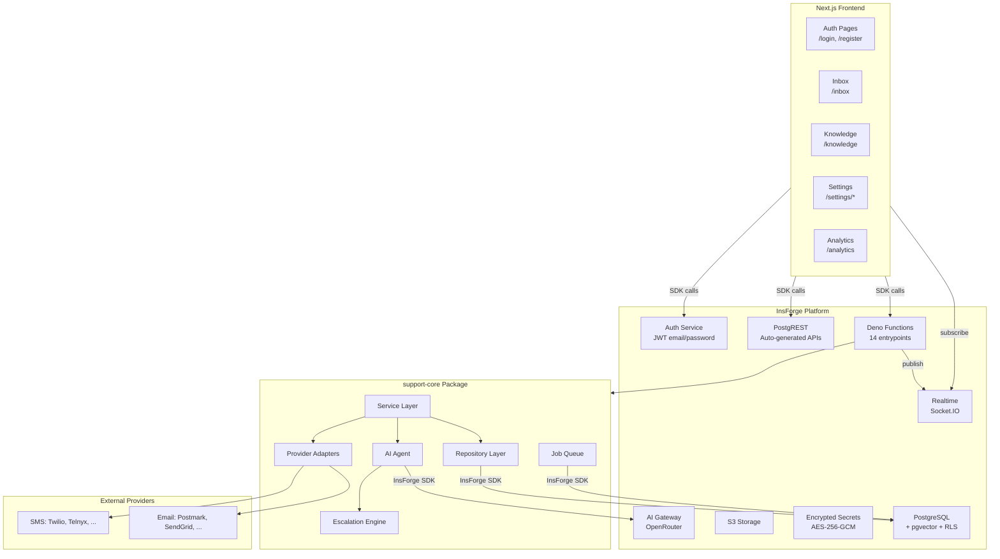
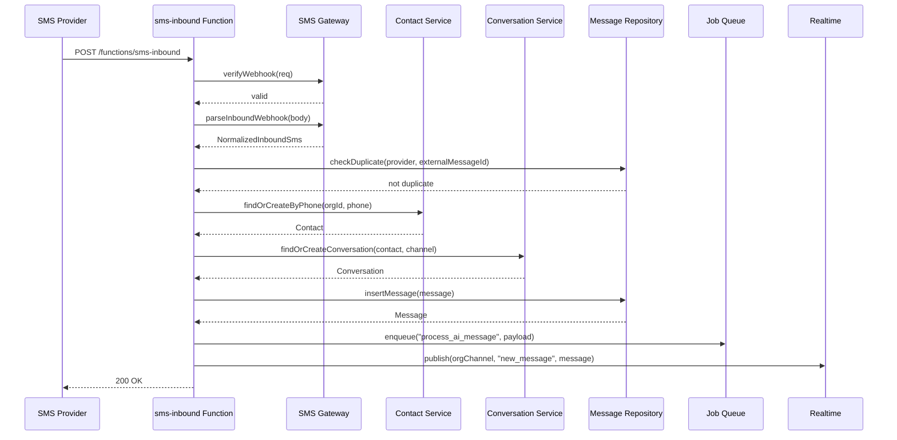
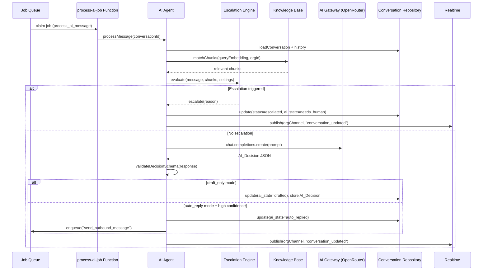
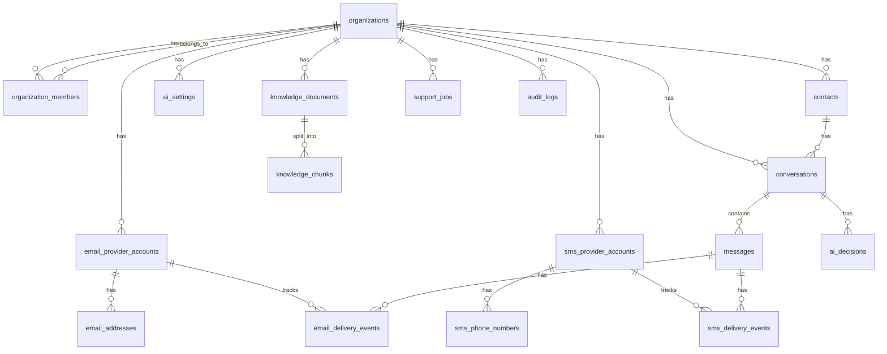

# Design Document — InboxPilot AI Customer Support Platform

## Overview

InboxPilot is a multi-tenant AI-powered customer support platform built on InsForge (BaaS). It handles inbound and outbound communication over SMS and email, uses AI to draft and auto-reply to messages, and escalates sensitive conversations to human agents. The architecture enforces strict portability: all business logic lives in provider-neutral modules that never import the InsForge SDK directly, enabling future migration.

The system follows a layered architecture:

```
Next.js Frontend
  → InsForge Auth (JWT)
  → InsForge PostgREST (auto-generated APIs with RLS)
  → InsForge Deno Functions (thin entrypoints)
    → support-core package (portable business logic)
      → Provider-neutral adapters (SMS, Email)
      → Repository layer (data access abstraction)
      → Postgres-backed Job Queue
  → InsForge Realtime (Socket.IO WebSocket)
  → InsForge AI Gateway (OpenRouter)
```

Key design decisions:
- **Portability over convenience**: Business logic never touches InsForge SDK. Repositories, adapters, and the job queue all sit behind interfaces.
- **Deterministic escalation before AI**: The Escalation Engine runs keyword/rule checks before any LLM call, saving cost and ensuring sensitive conversations never reach the AI.
- **Postgres-backed job queue**: No external queue service. Jobs use `SELECT FOR UPDATE SKIP LOCKED` for atomic claiming, exponential backoff for retries, and dead-lettering after max attempts.
- **Provider-neutral adapters**: SMS and email adapters implement a common interface. Mock + real adapters ship; others are stubs.

## Architecture

### System Architecture Diagram



### Request Flow — Inbound SMS Example



### AI Processing Flow



### Layered Architecture

The codebase is organized into four layers with strict dependency rules:

| Layer | Location | May Import | Never Imports |
|-------|----------|------------|---------------|
| **Function Entrypoints** | `insforge/functions/` | support-core services, InsForge SDK | — |
| **Service Layer** | `packages/support-core/services/` | Repositories, Adapters, AI Agent, Job Queue interfaces | InsForge SDK |
| **Repository Layer** | `packages/support-core/repositories/` | Database client interface | InsForge SDK directly (receives client via DI) |
| **Adapter Layer** | `packages/support-core/adapters/` | Provider SDKs, HTTP clients | InsForge SDK |

Dependency injection connects the layers: Function Entrypoints create InsForge SDK clients and pass them into Repository constructors and Service factories.

## Components and Interfaces

### 1. Provider Adapters

#### SmsProviderAdapter Interface

```typescript
interface SmsProviderAdapter {
  readonly providerId: string;

  sendSms(params: SendSmsParams): Promise<SendSmsResult>;
  parseInboundWebhook(body: unknown): NormalizedInboundSms;
  parseStatusWebhook(body: unknown): NormalizedDeliveryStatus;
  verifyWebhook(req: WebhookVerificationRequest): Promise<boolean>;
}

interface SendSmsParams {
  to: string;        // E.164 format
  from: string;      // E.164 format
  body: string;
  providerConfig: ProviderConfig;
}

interface SendSmsResult {
  externalMessageId: string;
  provider: string;
  status: 'queued' | 'sent';
}

interface NormalizedInboundSms {
  from: string;      // E.164
  to: string;        // E.164
  body: string;
  externalMessageId: string;
  rawPayload: Record<string, unknown>;
}

interface NormalizedDeliveryStatus {
  externalMessageId: string;
  status: 'queued' | 'sent' | 'delivered' | 'failed' | 'bounced';
  errorCode?: string;
  errorMessage?: string;
  rawPayload: Record<string, unknown>;
}

interface WebhookVerificationRequest {
  headers: Record<string, string>;
  body: string | Buffer;
  signingSecret: string;
}
```

Implementations: `MockSmsAdapter` (full), `TwilioSmsAdapter` (full), `TelnyxSmsAdapter` (full), `BandwidthSmsAdapter` (stub), `VonageSmsAdapter` (stub), `PlivoSmsAdapter` (stub), `MessageBirdSmsAdapter` (stub).

#### EmailProviderAdapter Interface

```typescript
interface EmailProviderAdapter {
  readonly providerId: string;

  sendEmail(params: SendEmailParams): Promise<SendEmailResult>;
  parseInboundWebhook(body: unknown): NormalizedInboundEmail;
  parseStatusWebhook(body: unknown): NormalizedDeliveryStatus;
  verifyWebhook(req: WebhookVerificationRequest): Promise<boolean>;
}

interface SendEmailParams {
  to: string;
  from: string;
  subject: string;
  bodyText: string;
  bodyHtml?: string;
  replyToMessageId?: string;
  providerConfig: ProviderConfig;
}

interface SendEmailResult {
  externalMessageId: string;
  provider: string;
  status: 'queued' | 'sent';
}

interface NormalizedInboundEmail {
  from: string;
  to: string;
  subject: string;
  bodyText: string;
  bodyHtml?: string;
  externalMessageId: string;
  inReplyTo?: string;
  rawPayload: Record<string, unknown>;
}
```

Implementations: `MockEmailAdapter` (full), `PostmarkEmailAdapter` (full), `MailgunEmailAdapter` (stub), `ResendEmailAdapter` (stub), `AwsSesEmailAdapter` (stub), `InsForgeEmailAdapter` (stub).

#### Provider Registry

```typescript
class ProviderRegistry {
  registerSmsAdapter(providerId: string, adapter: SmsProviderAdapter): void;
  registerEmailAdapter(providerId: string, adapter: EmailProviderAdapter): void;
  getSmsAdapter(providerId: string): SmsProviderAdapter;
  getEmailAdapter(providerId: string): EmailProviderAdapter;
}
```

The registry is populated at function startup. Each Function Entrypoint creates a registry, registers the adapters it needs, and passes it to the service layer.

### 2. Repository Layer

All repositories accept a database client interface (not the InsForge SDK directly) via constructor injection.

```typescript
interface DatabaseClient {
  from(table: string): QueryBuilder;
  rpc(functionName: string, args: Record<string, unknown>): Promise<unknown>;
}

class ContactRepository {
  constructor(private db: DatabaseClient) {}
  findByPhone(orgId: string, phone: string): Promise<Contact | null>;
  findByEmail(orgId: string, email: string): Promise<Contact | null>;
  create(contact: CreateContactInput): Promise<Contact>;
  update(id: string, updates: Partial<Contact>): Promise<Contact>;
}

class ConversationRepository {
  constructor(private db: DatabaseClient) {}
  findOpenByContactAndChannel(contactId: string, channel: Channel): Promise<Conversation | null>;
  create(conversation: CreateConversationInput): Promise<Conversation>;
  update(id: string, updates: Partial<Conversation>): Promise<Conversation>;
  listByOrg(orgId: string, filters: ConversationFilters): Promise<Conversation[]>;
}

class MessageRepository {
  constructor(private db: DatabaseClient) {}
  findByExternalId(provider: string, externalMessageId: string): Promise<Message | null>;
  create(message: CreateMessageInput): Promise<Message>;
  listByConversation(conversationId: string, limit?: number): Promise<Message[]>;
}

class KnowledgeRepository {
  constructor(private db: DatabaseClient) {}
  createDocument(doc: CreateDocumentInput): Promise<KnowledgeDocument>;
  updateDocument(id: string, updates: Partial<KnowledgeDocument>): Promise<KnowledgeDocument>;
  deleteDocumentWithChunks(id: string): Promise<void>;
  insertChunks(chunks: CreateChunkInput[]): Promise<KnowledgeChunk[]>;
  deleteChunksByDocument(documentId: string): Promise<void>;
  matchChunks(queryEmbedding: number[], orgId: string, limit: number, threshold: number): Promise<KnowledgeChunk[]>;
}

class AuditLogRepository {
  constructor(private db: DatabaseClient) {}
  create(entry: CreateAuditLogInput): Promise<AuditLog>;
  // No update or delete methods — append-only
}
```

Additional repositories: `OrganizationRepository`, `MemberRepository`, `AiSettingsRepository`, `AiDecisionRepository`, `JobRepository`, `SmsProviderAccountRepository`, `EmailProviderAccountRepository`, `DeliveryEventRepository`.

### 3. Service Layer

Services orchestrate business logic using repositories, adapters, and the job queue. They never import InsForge SDK.

```typescript
class InboundMessageService {
  constructor(
    private contactRepo: ContactRepository,
    private conversationRepo: ConversationRepository,
    private messageRepo: MessageRepository,
    private jobQueue: JobQueue,
    private auditLog: AuditLogRepository
  ) {}

  async processInboundSms(normalized: NormalizedInboundSms, orgId: string): Promise<Message>;
  async processInboundEmail(normalized: NormalizedInboundEmail, orgId: string): Promise<Message>;
}

class OutboundMessageService {
  constructor(
    private conversationRepo: ConversationRepository,
    private messageRepo: MessageRepository,
    private providerRegistry: ProviderRegistry,
    private smsAccountRepo: SmsProviderAccountRepository,
    private emailAccountRepo: EmailProviderAccountRepository,
    private auditLog: AuditLogRepository
  ) {}

  async sendReply(conversationId: string, body: string, userId: string): Promise<Message>;
}

class AiAgentService {
  constructor(
    private conversationRepo: ConversationRepository,
    private messageRepo: MessageRepository,
    private knowledgeRepo: KnowledgeRepository,
    private aiSettingsRepo: AiSettingsRepository,
    private aiDecisionRepo: AiDecisionRepository,
    private escalationEngine: EscalationEngine,
    private aiClient: AiClient,
    private jobQueue: JobQueue,
    private auditLog: AuditLogRepository
  ) {}

  async processMessage(conversationId: string, orgId: string): Promise<AiDecision>;
}

class KnowledgeIngestionService {
  constructor(
    private knowledgeRepo: KnowledgeRepository,
    private aiClient: AiClient,
    private auditLog: AuditLogRepository
  ) {}

  async processDocument(documentId: string): Promise<void>;
}
```

### 4. Escalation Engine

The Escalation Engine is a pure, deterministic rule evaluator. It runs before any LLM call.

```typescript
interface EscalationRule {
  readonly name: string;
  evaluate(context: EscalationContext): EscalationResult | null;
}

interface EscalationContext {
  latestMessage: string;
  conversationHistory: Message[];
  knowledgeChunks: KnowledgeChunk[];
  knowledgeSimilarityThreshold: number;
  aiSettings: AiSettings;
  consecutiveAiFailures: number;
}

interface EscalationResult {
  triggered: true;
  reason: string;
  ruleName: string;
}

class EscalationEngine {
  private rules: EscalationRule[] = [];

  register(rule: EscalationRule): void;
  evaluate(context: EscalationContext): EscalationResult | null;
}
```

Built-in rules:
1. `HumanRequestRule` — detects phrases like "speak to a human", "talk to a person"
2. `ProfanityAngerRule` — detects profanity/anger above threshold
3. `SensitiveTopicRule` — detects legal threats, chargebacks, refunds, billing errors, cancellations
4. `SafetyConcernRule` — detects security, medical, legal, safety issues
5. `MissingKnowledgeRule` — triggers when no knowledge chunks exceed similarity threshold
6. `LowConfidenceRule` — triggers when AI_Decision confidence < configured minimum
7. `RepeatedFailureRule` — triggers when consecutive AI failures ≥ configured max
8. `KeywordRule` — triggers on organization-configured escalation keywords

### 5. AI Client Interface

```typescript
interface AiClient {
  chatCompletion(params: ChatCompletionParams): Promise<ChatCompletionResult>;
  createEmbedding(params: EmbeddingParams): Promise<number[]>;
}

interface ChatCompletionParams {
  model: string;
  messages: ChatMessage[];
  responseFormat?: { type: 'json_object' };
  temperature?: number;
}
```

The InsForge AI gateway is wrapped in an `InsForgeAiClient` that implements this interface. The `AiAgentService` only depends on the `AiClient` interface.

### 6. Job Queue Interface

```typescript
interface JobQueue {
  enqueue(jobType: JobType, payload: Record<string, unknown>, orgId: string): Promise<Job>;
  claim(limit: number): Promise<Job[]>;
  complete(jobId: string): Promise<void>;
  fail(jobId: string, error: string): Promise<void>;
}

type JobType =
  | 'process_ai_message'
  | 'process_knowledge_document'
  | 'send_outbound_message'
  | 'process_delivery_status'
  | 'retry_failed_jobs';

interface Job {
  id: string;
  organizationId: string;
  jobType: JobType;
  payload: Record<string, unknown>;
  status: 'pending' | 'claimed' | 'completed' | 'failed' | 'dead';
  attempts: number;
  maxAttempts: number;
  lastError: string | null;
  runAfter: Date;
  createdAt: Date;
  updatedAt: Date;
  completedAt: Date | null;
}
```

The `PostgresJobQueue` implementation uses `claim_support_jobs` RPC for atomic claiming with `SELECT FOR UPDATE SKIP LOCKED`. Exponential backoff: `run_after = now() + (2^attempts * 1000)ms`. Dead-lettering: when `attempts >= max_attempts`, status becomes `dead`.

Idempotency: before enqueuing, the queue checks for an existing pending/claimed job with the same `job_type` and a matching subset of payload keys (e.g., `conversation_id` for `process_ai_message`).

### 7. Realtime Publishing

```typescript
interface RealtimePublisher {
  publish(channel: string, event: string, data: unknown): Promise<void>;
}
```

Events published:
- `new_message` — when a message is inserted (inbound or outbound)
- `conversation_updated` — when conversation status or ai_state changes
- `knowledge_document_updated` — when document status changes

Channel naming: `org:{organizationId}` — all members of an org subscribe to the same channel.

### 8. Function Entrypoints

All 14 functions follow the same pattern:

```typescript
// insforge/functions/sms-inbound/index.ts
export default async function(req: Request): Promise<Response> {
  // 1. Parse request
  // 2. Authenticate (verify JWT or webhook signature)
  // 3. Create dependencies (SDK client, repos, services)
  // 4. Delegate to service
  // 5. Return response
}
```

| Function | Auth | Trigger | Delegates To |
|----------|------|---------|-------------|
| `sms-inbound` | Webhook signature | SMS provider webhook | InboundMessageService |
| `sms-status` | Webhook signature | SMS provider webhook | DeliveryStatusService |
| `email-inbound` | Webhook signature | Email provider webhook | InboundMessageService |
| `email-status` | Webhook signature | Email provider webhook | DeliveryStatusService |
| `send-reply` | JWT | Frontend | OutboundMessageService |
| `approve-ai-draft` | JWT | Frontend | AiDraftService |
| `regenerate-ai-draft` | JWT | Frontend | AiDraftService |
| `process-ai-job` | Internal (job queue) | process-jobs scheduler | AiAgentService |
| `process-knowledge-document` | Internal (job queue) | process-jobs scheduler | KnowledgeIngestionService |
| `process-jobs` | Cron / manual | Scheduler | JobProcessorService |
| `escalate-conversation` | JWT | Frontend | ConversationService |
| `resolve-conversation` | JWT | Frontend | ConversationService |
| `reopen-conversation` | JWT | Frontend | ConversationService |
| `test-channel-connection` | JWT | Frontend | ChannelTestService |


## Data Models

### Entity Relationship Diagram



### Table Definitions

#### organizations

| Column | Type | Constraints |
|--------|------|-------------|
| id | uuid | PK, DEFAULT gen_random_uuid() |
| name | text | NOT NULL |
| slug | text | NOT NULL, UNIQUE |
| metadata | jsonb | DEFAULT '{}' |
| created_at | timestamptz | NOT NULL, DEFAULT now() |
| updated_at | timestamptz | NOT NULL, DEFAULT now() |

#### organization_members

| Column | Type | Constraints |
|--------|------|-------------|
| id | uuid | PK, DEFAULT gen_random_uuid() |
| organization_id | uuid | NOT NULL, FK → organizations(id) ON DELETE CASCADE |
| user_id | text | NOT NULL (InsForge user ID, e.g. usr_abc123) |
| role | text | NOT NULL, CHECK (role IN ('owner', 'admin', 'agent', 'viewer')) |
| created_at | timestamptz | NOT NULL, DEFAULT now() |
| updated_at | timestamptz | NOT NULL, DEFAULT now() |
| UNIQUE | | (organization_id, user_id) |

#### contacts

| Column | Type | Constraints |
|--------|------|-------------|
| id | uuid | PK, DEFAULT gen_random_uuid() |
| organization_id | uuid | NOT NULL, FK → organizations(id) ON DELETE CASCADE |
| name | text | |
| email | text | |
| phone | text | (E.164 format) |
| metadata | jsonb | DEFAULT '{}' |
| created_at | timestamptz | NOT NULL, DEFAULT now() |
| updated_at | timestamptz | NOT NULL, DEFAULT now() |
| INDEX | | (organization_id) |
| INDEX | | (organization_id, phone) WHERE phone IS NOT NULL |
| INDEX | | (organization_id, email) WHERE email IS NOT NULL |

#### conversations

| Column | Type | Constraints |
|--------|------|-------------|
| id | uuid | PK, DEFAULT gen_random_uuid() |
| organization_id | uuid | NOT NULL, FK → organizations(id) ON DELETE CASCADE |
| contact_id | uuid | NOT NULL, FK → contacts(id) ON DELETE CASCADE |
| channel | text | NOT NULL, CHECK (channel IN ('sms', 'email')) |
| status | text | NOT NULL, DEFAULT 'open', CHECK (status IN ('open', 'resolved', 'escalated')) |
| ai_state | text | NOT NULL, DEFAULT 'idle', CHECK (ai_state IN ('idle', 'thinking', 'drafted', 'auto_replied', 'needs_human', 'failed')) |
| subject | text | (email conversations) |
| assigned_to | uuid | FK → organization_members(id) |
| last_message_at | timestamptz | |
| metadata | jsonb | DEFAULT '{}' |
| created_at | timestamptz | NOT NULL, DEFAULT now() |
| updated_at | timestamptz | NOT NULL, DEFAULT now() |
| INDEX | | (organization_id, status) |
| INDEX | | (contact_id) |
| INDEX | | (organization_id, last_message_at DESC) |

#### messages

| Column | Type | Constraints |
|--------|------|-------------|
| id | uuid | PK, DEFAULT gen_random_uuid() |
| conversation_id | uuid | NOT NULL, FK → conversations(id) ON DELETE CASCADE |
| sender_type | text | NOT NULL, CHECK (sender_type IN ('contact', 'user', 'ai', 'system')) |
| sender_id | text | (user_id for user, null for contact/ai/system) |
| direction | text | NOT NULL, CHECK (direction IN ('inbound', 'outbound')) |
| channel | text | NOT NULL, CHECK (channel IN ('sms', 'email')) |
| body | text | NOT NULL |
| subject | text | (email messages) |
| raw_payload | jsonb | DEFAULT '{}' |
| provider | text | |
| provider_account_id | uuid | |
| external_message_id | text | |
| delivery_status | text | DEFAULT 'pending', CHECK (delivery_status IN ('pending', 'queued', 'sent', 'delivered', 'failed', 'bounced')) |
| created_at | timestamptz | NOT NULL, DEFAULT now() |
| updated_at | timestamptz | NOT NULL, DEFAULT now() |
| UNIQUE | | (provider, external_message_id) WHERE provider IS NOT NULL AND external_message_id IS NOT NULL |

#### sms_provider_accounts

| Column | Type | Constraints |
|--------|------|-------------|
| id | uuid | PK, DEFAULT gen_random_uuid() |
| organization_id | uuid | NOT NULL, FK → organizations(id) ON DELETE CASCADE |
| provider | text | NOT NULL (e.g. 'twilio', 'telnyx', 'mock') |
| label | text | NOT NULL |
| credentials_secret_id | text | NOT NULL (reference to InsForge encrypted secret) |
| is_active | boolean | NOT NULL, DEFAULT true |
| metadata | jsonb | DEFAULT '{}' |
| created_at | timestamptz | NOT NULL, DEFAULT now() |
| updated_at | timestamptz | NOT NULL, DEFAULT now() |

#### sms_phone_numbers

| Column | Type | Constraints |
|--------|------|-------------|
| id | uuid | PK, DEFAULT gen_random_uuid() |
| provider_account_id | uuid | NOT NULL, FK → sms_provider_accounts(id) ON DELETE CASCADE |
| organization_id | uuid | NOT NULL, FK → organizations(id) ON DELETE CASCADE |
| phone_number | text | NOT NULL (E.164 format) |
| is_default | boolean | NOT NULL, DEFAULT false |
| created_at | timestamptz | NOT NULL, DEFAULT now() |

#### sms_delivery_events

| Column | Type | Constraints |
|--------|------|-------------|
| id | uuid | PK, DEFAULT gen_random_uuid() |
| message_id | uuid | NOT NULL, FK → messages(id) ON DELETE CASCADE |
| provider_account_id | uuid | FK → sms_provider_accounts(id) |
| status | text | NOT NULL |
| error_code | text | |
| error_message | text | |
| raw_payload | jsonb | DEFAULT '{}' |
| created_at | timestamptz | NOT NULL, DEFAULT now() |

#### email_provider_accounts

| Column | Type | Constraints |
|--------|------|-------------|
| id | uuid | PK, DEFAULT gen_random_uuid() |
| organization_id | uuid | NOT NULL, FK → organizations(id) ON DELETE CASCADE |
| provider | text | NOT NULL (e.g. 'postmark', 'sendgrid', 'mock') |
| label | text | NOT NULL |
| credentials_secret_id | text | NOT NULL |
| is_active | boolean | NOT NULL, DEFAULT true |
| metadata | jsonb | DEFAULT '{}' |
| created_at | timestamptz | NOT NULL, DEFAULT now() |
| updated_at | timestamptz | NOT NULL, DEFAULT now() |

#### email_addresses

| Column | Type | Constraints |
|--------|------|-------------|
| id | uuid | PK, DEFAULT gen_random_uuid() |
| provider_account_id | uuid | NOT NULL, FK → email_provider_accounts(id) ON DELETE CASCADE |
| organization_id | uuid | NOT NULL, FK → organizations(id) ON DELETE CASCADE |
| email_address | text | NOT NULL |
| is_default | boolean | NOT NULL, DEFAULT false |
| created_at | timestamptz | NOT NULL, DEFAULT now() |

#### email_delivery_events

| Column | Type | Constraints |
|--------|------|-------------|
| id | uuid | PK, DEFAULT gen_random_uuid() |
| message_id | uuid | NOT NULL, FK → messages(id) ON DELETE CASCADE |
| provider_account_id | uuid | FK → email_provider_accounts(id) |
| status | text | NOT NULL |
| error_code | text | |
| error_message | text | |
| raw_payload | jsonb | DEFAULT '{}' |
| created_at | timestamptz | NOT NULL, DEFAULT now() |

#### ai_settings

| Column | Type | Constraints |
|--------|------|-------------|
| id | uuid | PK, DEFAULT gen_random_uuid() |
| organization_id | uuid | NOT NULL, UNIQUE, FK → organizations(id) ON DELETE CASCADE |
| ai_mode | text | NOT NULL, DEFAULT 'draft_only', CHECK (ai_mode IN ('off', 'draft_only', 'auto_reply')) |
| confidence_threshold | numeric(3,2) | NOT NULL, DEFAULT 0.75 |
| context_window_size | integer | NOT NULL, DEFAULT 20 |
| max_consecutive_failures | integer | NOT NULL, DEFAULT 3 |
| knowledge_similarity_threshold | numeric(3,2) | NOT NULL, DEFAULT 0.70 |
| escalation_keywords | text[] | DEFAULT '{}' |
| system_prompt | text | |
| model | text | NOT NULL, DEFAULT 'openai/gpt-4o-mini' |
| created_at | timestamptz | NOT NULL, DEFAULT now() |
| updated_at | timestamptz | NOT NULL, DEFAULT now() |

#### ai_decisions

| Column | Type | Constraints |
|--------|------|-------------|
| id | uuid | PK, DEFAULT gen_random_uuid() |
| conversation_id | uuid | NOT NULL, FK → conversations(id) ON DELETE CASCADE |
| organization_id | uuid | NOT NULL, FK → organizations(id) ON DELETE CASCADE |
| message_id | uuid | FK → messages(id) (the inbound message that triggered this decision) |
| decision_type | text | NOT NULL, CHECK (decision_type IN ('respond', 'escalate', 'clarify')) |
| confidence | numeric(3,2) | NOT NULL |
| reasoning_summary | text | |
| response_text | text | |
| tags | text[] | DEFAULT '{}' |
| requires_human | boolean | NOT NULL, DEFAULT false |
| raw_response | jsonb | (full LLM response for debugging) |
| created_at | timestamptz | NOT NULL, DEFAULT now() |

#### knowledge_documents

| Column | Type | Constraints |
|--------|------|-------------|
| id | uuid | PK, DEFAULT gen_random_uuid() |
| organization_id | uuid | NOT NULL, FK → organizations(id) ON DELETE CASCADE |
| title | text | NOT NULL |
| source_type | text | NOT NULL |
| body | text | NOT NULL |
| status | text | NOT NULL, DEFAULT 'pending', CHECK (status IN ('pending', 'processing', 'ready', 'failed')) |
| error_message | text | |
| created_at | timestamptz | NOT NULL, DEFAULT now() |
| updated_at | timestamptz | NOT NULL, DEFAULT now() |
| INDEX | | (organization_id) |

#### knowledge_chunks

| Column | Type | Constraints |
|--------|------|-------------|
| id | uuid | PK, DEFAULT gen_random_uuid() |
| document_id | uuid | NOT NULL, FK → knowledge_documents(id) ON DELETE CASCADE |
| organization_id | uuid | NOT NULL, FK → organizations(id) ON DELETE CASCADE |
| content | text | NOT NULL |
| embedding | vector(1536) | NOT NULL |
| metadata | jsonb | DEFAULT '{}' |
| created_at | timestamptz | NOT NULL, DEFAULT now() |
| INDEX | | HNSW on (embedding vector_cosine_ops) |

#### support_jobs

| Column | Type | Constraints |
|--------|------|-------------|
| id | uuid | PK, DEFAULT gen_random_uuid() |
| organization_id | uuid | NOT NULL, FK → organizations(id) ON DELETE CASCADE |
| job_type | text | NOT NULL |
| payload | jsonb | NOT NULL, DEFAULT '{}' |
| status | text | NOT NULL, DEFAULT 'pending', CHECK (status IN ('pending', 'claimed', 'completed', 'failed', 'dead')) |
| attempts | integer | NOT NULL, DEFAULT 0 |
| max_attempts | integer | NOT NULL, DEFAULT 5 |
| last_error | text | |
| run_after | timestamptz | NOT NULL, DEFAULT now() |
| created_at | timestamptz | NOT NULL, DEFAULT now() |
| updated_at | timestamptz | NOT NULL, DEFAULT now() |
| completed_at | timestamptz | |
| INDEX | | (status, run_after) WHERE status = 'pending' |

#### audit_logs

| Column | Type | Constraints |
|--------|------|-------------|
| id | uuid | PK, DEFAULT gen_random_uuid() |
| organization_id | uuid | NOT NULL, FK → organizations(id) ON DELETE CASCADE |
| actor_id | text | |
| actor_type | text | NOT NULL, CHECK (actor_type IN ('user', 'system', 'ai')) |
| action | text | NOT NULL |
| resource_type | text | NOT NULL |
| resource_id | text | |
| metadata | jsonb | DEFAULT '{}' |
| created_at | timestamptz | NOT NULL, DEFAULT now() |
| INDEX | | (organization_id, created_at DESC) |

### Key Database Functions (RPC)

#### match_knowledge_chunks

```sql
CREATE OR REPLACE FUNCTION match_knowledge_chunks(
  query_embedding vector(1536),
  match_org_id uuid,
  match_limit int DEFAULT 5,
  match_threshold float DEFAULT 0.7
)
RETURNS TABLE (
  id uuid,
  document_id uuid,
  content text,
  metadata jsonb,
  similarity float
)
LANGUAGE plpgsql AS $$
BEGIN
  RETURN QUERY
  SELECT
    kc.id,
    kc.document_id,
    kc.content,
    kc.metadata,
    1 - (kc.embedding <=> query_embedding) AS similarity
  FROM knowledge_chunks kc
  WHERE kc.organization_id = match_org_id
    AND 1 - (kc.embedding <=> query_embedding) > match_threshold
  ORDER BY kc.embedding <=> query_embedding
  LIMIT match_limit;
END;
$$;
```

#### claim_support_jobs

```sql
CREATE OR REPLACE FUNCTION claim_support_jobs(
  claim_limit int DEFAULT 5
)
RETURNS SETOF support_jobs
LANGUAGE plpgsql AS $$
BEGIN
  RETURN QUERY
  UPDATE support_jobs
  SET status = 'claimed', updated_at = now()
  WHERE id IN (
    SELECT id FROM support_jobs
    WHERE status = 'pending'
      AND run_after <= now()
    ORDER BY created_at ASC
    FOR UPDATE SKIP LOCKED
    LIMIT claim_limit
  )
  RETURNING *;
END;
$$;
```

### AI_Decision JSON Schema

The LLM is instructed to return JSON conforming to this schema:

```json
{
  "decision_type": "respond | escalate | clarify",
  "confidence": 0.0-1.0,
  "reasoning_summary": "string",
  "response_text": "string | null",
  "tags": ["string"],
  "requires_human": false
}
```

Validation uses a strict JSON schema check. If the LLM response fails parsing, the conversation ai_state is set to "failed".

### Phone Number Normalization

Phone numbers are normalized to E.164 format before storage and lookup:
- Strip all non-digit characters except leading `+`
- If no country code, assume US (+1)
- Validate length (E.164: max 15 digits including country code)
- Store with leading `+`

### Email Normalization

Email addresses are normalized before storage and lookup:
- Convert to lowercase
- Trim whitespace
- Validate format (basic RFC 5322 check)


## Correctness Properties

*A property is a characteristic or behavior that should hold true across all valid executions of a system — essentially, a formal statement about what the system should do. Properties serve as the bridge between human-readable specifications and machine-verifiable correctness guarantees.*

### Property 1: Phone number normalization round-trip

*For any* valid phone number string in any common format (with or without country code, dashes, spaces, parentheses), normalizing it to E.164 and then normalizing the E.164 result again SHALL produce the same E.164 string (idempotence).

**Validates: Requirements 4.1**

### Property 2: Email normalization idempotence

*For any* valid email address string with arbitrary casing and leading/trailing whitespace, normalizing it (lowercase + trim) and then normalizing the result again SHALL produce the same normalized string.

**Validates: Requirements 4.2**

### Property 3: Webhook payload normalization round-trip

*For any* valid inbound SMS webhook payload (across mock, Twilio, and Telnyx formats) or valid inbound email webhook payload (across mock and Postmark formats), normalizing the payload, serializing the normalized result to JSON, deserializing it, and normalizing again SHALL produce an equivalent normalized payload.

**Validates: Requirements 7.2, 8.2, 29.1, 29.2, 29.10**

### Property 4: AI_Decision JSON round-trip

*For any* valid AI_Decision object (with decision_type in {respond, escalate, clarify}, confidence in [0.0, 1.0], string reasoning_summary, optional response_text, string array tags, and boolean requires_human), serializing to JSON and parsing back SHALL produce an equivalent AI_Decision object.

**Validates: Requirements 11.4, 29.5, 29.9**

### Property 5: Invalid JSON always produces failure state

*For any* string that is not valid JSON or does not conform to the AI_Decision schema, attempting to parse it as an AI_Decision SHALL result in a parse error (never a valid AI_Decision).

**Validates: Requirements 11.5**

### Property 6: Escalation engine triggers on matching content

*For any* escalation context where the latest message contains a human-request phrase, profanity, sensitive topic keyword, safety concern keyword, or any keyword from the organization's escalation keyword list, the Escalation Engine SHALL return a non-null EscalationResult with the correct reason. Conversely, *for any* message that contains none of these triggers and the context has sufficient knowledge chunks above threshold, confidence above minimum, and failures below max, the Escalation Engine SHALL return null.

**Validates: Requirements 12.1, 12.2, 12.3, 12.4, 12.5, 12.6, 12.7, 12.8**

### Property 7: Message deduplication idempotence

*For any* inbound message with a given (provider, external_message_id) pair, processing the message N times (N ≥ 1) SHALL result in exactly one stored Message record. Subsequent processing attempts SHALL be discarded without error.

**Validates: Requirements 6.2, 6.3, 29.3**

### Property 8: Job queue exponential backoff and dead-lettering

*For any* job that fails, the run_after timestamp SHALL be set to now() + 2^attempts seconds. *For any* job where attempts reaches max_attempts, the status SHALL be set to "dead" and no further retries SHALL be scheduled.

**Validates: Requirements 13.4, 13.5, 29.8**

### Property 9: Job enqueue idempotency

*For any* job type and payload, enqueuing the same job twice (while the first is still pending or claimed) SHALL result in exactly one job record in pending or claimed status.

**Validates: Requirements 13.8**

### Property 10: Job claim respects limit and pending status

*For any* set of jobs in the support_jobs table, calling claim_support_jobs(N) SHALL return at most N jobs, all of which were in "pending" status with run_after ≤ now() before the claim, and all of which are now in "claimed" status.

**Validates: Requirements 13.2**

### Property 11: Auto-reply threshold gating

*For any* AI_Decision with confidence C and organization confidence_threshold T, the system SHALL auto-send the response if and only if the AI mode is "auto_reply", C ≥ T, and requires_human is false. In all other cases, the response SHALL NOT be auto-sent.

**Validates: Requirements 11.8**

### Property 12: Conversation state machine invariant

*For any* conversation at any point in its lifecycle, the status SHALL be exactly one of {open, resolved, escalated} and the ai_state SHALL be exactly one of {idle, thinking, drafted, auto_replied, needs_human, failed}. No operation SHALL produce a status or ai_state value outside these sets.

**Validates: Requirements 5.3, 5.4**

### Property 13: Organization owner invariant

*For any* organization and any sequence of member add, remove, and role-change operations, there SHALL be exactly one member with the "owner" role at all times. Operations that would violate this invariant SHALL be rejected.

**Validates: Requirements 2.2**

### Property 14: RBAC permission enforcement

*For any* member with a given role and any operation on an organization resource, the permission check SHALL grant access if and only if the operation is within the role's permitted set. Specifically: owner has full access; admin has all access except owner transfer and org deletion; agent can view/reply conversations, view knowledge base, and view settings; viewer has read-only access to conversations and knowledge base.

**Validates: Requirements 3.1, 3.2, 3.3, 3.4**

### Property 15: Audit log immutability

*For any* audit log entry, once created, UPDATE and DELETE operations on that entry SHALL be rejected by the database. The audit_logs table SHALL be append-only.

**Validates: Requirements 22.3**

### Property 16: Knowledge chunk similarity ordering

*For any* query embedding and organization, the match_knowledge_chunks function SHALL return chunks ordered by cosine similarity descending, with all returned chunks having similarity above the specified threshold, and the result count SHALL not exceed the specified limit.

**Validates: Requirements 10.5**

### Property 17: Document chunking coverage

*For any* non-empty document body, the ingestion pipeline's chunking function SHALL produce at least one chunk, and the concatenation of all chunk contents SHALL contain all text from the original document body (no content loss).

**Validates: Requirements 10.1**

## Error Handling

### Error Categories and Responses

| Category | HTTP Status | Behavior |
|----------|-------------|----------|
| Authentication failure | 401 | Return generic error, no email existence leak |
| Authorization failure | 403 | Return "insufficient permissions" |
| Resource not found | 404 | Return "resource not found" |
| Duplicate webhook | 200 | Discard silently, return success to provider |
| Validation error | 400 | Return field-level error details |
| Provider API error | 502 | Log error, record in job, retry via queue |
| AI parsing error | — | Set ai_state to "failed", log raw response |
| Unhandled error | 500 | Log error, record audit log entry |

### Retry Strategy

All retryable operations go through the Job Queue:
- **Max attempts**: 5 (configurable per job type)
- **Backoff**: Exponential — `2^attempts` seconds
- **Dead-lettering**: After max_attempts, job status → "dead"
- **Idempotency**: Jobs check for duplicates before enqueuing

### Provider Failure Handling

- SMS/Email send failures: Job retries with backoff. After dead-lettering, message delivery_status → "failed".
- Webhook verification failures: Return 401, discard payload, no retry.
- AI gateway failures: Set ai_state to "failed", increment consecutive failure counter. If counter hits max, escalation triggers on next message.

### Knowledge Ingestion Failure

- Chunking failure: Document status → "failed", error recorded.
- Embedding API failure: Document status → "failed", partial chunks cleaned up.
- Re-processing: Admin can update document body to re-trigger ingestion.

### Frontend Error Handling

- Network errors: Toast notification with retry option.
- Auth errors (401): Redirect to /login.
- Permission errors (403): Display "insufficient permissions" message.
- Optimistic updates: Revert on failure with error toast.

## Testing Strategy

### Testing Framework

- **Unit tests**: Vitest (TypeScript, fast, ESM-native)
- **Property-based tests**: fast-check (via Vitest)
- **Integration tests**: Vitest with InsForge test instance
- **E2E tests**: Playwright (future, not MVP scope)

### Property-Based Testing Configuration

- Library: `fast-check` (npm package `fast-check`)
- Minimum iterations: 100 per property test
- Each property test references its design document property
- Tag format: `Feature: ai-customer-support, Property {number}: {property_text}`

### Test Organization

```
packages/support-core/
  __tests__/
    properties/           # Property-based tests
      normalization.prop.test.ts    # Properties 1, 2
      webhook-roundtrip.prop.test.ts # Property 3
      ai-decision.prop.test.ts      # Properties 4, 5
      escalation.prop.test.ts       # Property 6
      deduplication.prop.test.ts    # Property 7
      job-queue.prop.test.ts        # Properties 8, 9, 10
      auto-reply.prop.test.ts       # Property 11
      state-machine.prop.test.ts    # Property 12
      rbac.prop.test.ts             # Properties 13, 14
      audit-log.prop.test.ts        # Property 15
      knowledge.prop.test.ts        # Properties 16, 17
    unit/                 # Example-based unit tests
      contact-service.test.ts
      conversation-service.test.ts
      message-service.test.ts
      ai-agent-service.test.ts
      knowledge-ingestion.test.ts
      job-queue.test.ts
      escalation-engine.test.ts
    integration/          # Integration tests
      inbound-sms-flow.test.ts
      inbound-email-flow.test.ts
      outbound-message-flow.test.ts
      rls-policies.test.ts
      realtime-events.test.ts
```

### Unit Test Coverage (Example-Based)

Unit tests focus on specific scenarios and edge cases not covered by property tests:

- **Contact Service**: Find-or-create with new vs existing contact, phone vs email matching
- **Conversation Service**: Create new conversation, append to existing, resolve/reopen state transitions, escalation state transition
- **Message Service**: Outbound message creation with provider fields populated
- **AI Agent Service**: AI mode gating (off/draft_only/auto_reply), escalation before LLM call, LLM call with mock client
- **Knowledge Ingestion**: Document status transitions (pending → processing → ready/failed), chunk cleanup on failure
- **Escalation Engine**: Individual rule tests with specific trigger phrases
- **Function Entrypoints**: Auth failure → 401, unhandled error → 500

### Integration Test Coverage

- **Inbound SMS/Email flow**: End-to-end with mock adapters verifying contact creation, conversation creation, message insertion, and job enqueue
- **Outbound message flow**: Reply sending with mock adapter verifying message record and delivery tracking
- **RLS policies**: Two-org test verifying cross-org data isolation
- **Realtime events**: Verify events are published on message insert and conversation update
- **Seed script**: Verify idempotent execution creates expected data without duplicates
