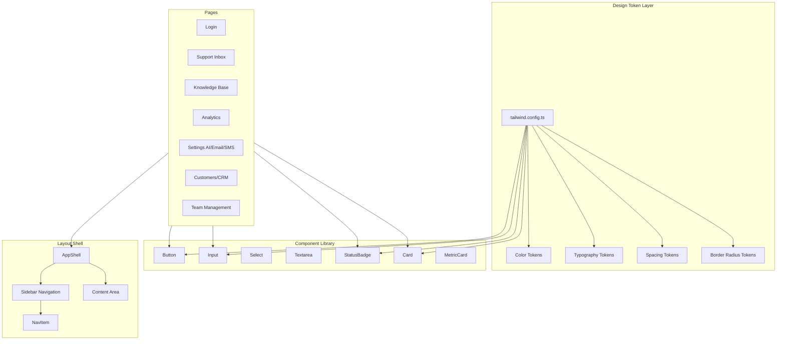

# Design Document: Stitch UI Implementation

## Overview

This design implements the "Efficient Precision" design system from the Stitch project into the InboxPilot Next.js application. The implementation covers four layers:

1. **Design Token Layer** — Tailwind CSS 3.4 configuration extension with all Stitch tokens (colors, typography, spacing, radii)
2. **Component Library** — Reusable React components (Button, Input, Select, Textarea, StatusBadge, Card, MetricCard) matching the Stitch design
3. **Layout Shell** — Persistent sidebar navigation with responsive collapse behavior
4. **Page Compositions** — All 9 screens rebuilt using the component library and layout shell

The design prioritizes:
- Zero runtime CSS overhead (all tokens compile to Tailwind utilities)
- Incremental adoption (new components coexist with existing inbox components)
- Accessibility (WCAG 2.1 AA compliance, keyboard navigation, ARIA landmarks)
- Server component compatibility (components are client-only when they need interactivity)

## Architecture



### Key Design Decisions

1. **Tailwind extension over CSS variables**: Tokens live in `tailwind.config.ts` rather than CSS custom properties. This gives full IntelliSense support and allows purging unused utilities. CSS variables are used only for the few cases needing runtime theming.

2. **`components/ui/` folder for shared components**: A new `components/ui/` directory separates design-system primitives from domain components (`components/inbox/`). This aligns with common conventions (shadcn/ui pattern) and avoids polluting the inbox namespace.

3. **`components/layout/` for shell components**: AppShell, Sidebar, and NavItem live here since they're structural, not UI primitives.

4. **Class variance utility via plain objects**: Rather than introducing a `class-variance-authority` dependency, variant mapping uses simple TypeScript record objects with a `cn()` helper (wrapping `clsx` + Tailwind merge isn't needed since we control all class strings and avoid conflicts).

5. **No Tailwind Merge dependency**: Since we control all class compositions and don't accept arbitrary className overrides from consumers, we avoid the `tailwind-merge` bundle cost. Components expose a `className` prop for layout-only overrides (margin, width).

## Components and Interfaces

### Design Token Configuration (`tailwind.config.ts`)

```typescript
// Extended theme tokens
{
  colors: {
    primary: {
      DEFAULT: '#4F46E5',
      50: '#EEF2FF', 100: '#E0E7FF', 200: '#C7D2FE',
      500: '#4F46E5', 600: '#4338CA', 700: '#3730A3',
    },
    ai: {
      DEFAULT: '#8B5CF6',
      50: '#F5F3FF', 100: '#EDE9FE', 200: '#DDD6FE',
      500: '#8B5CF6', 600: '#7C3AED', 700: '#6D28D9',
    },
    status: {
      open: { light: '#FFF7ED', DEFAULT: '#F59E0B', dark: '#C2410C' },
      escalated: { light: '#FEF2F2', DEFAULT: '#EF4444', dark: '#B91C1C' },
      resolved: { light: '#F0FDF4', DEFAULT: '#10B981', dark: '#15803D' },
      ai_draft: { light: '#F5F3FF', DEFAULT: '#8B5CF6', dark: '#6D28D9' },
    },
    surface: {
      background: '#F9FAFB',
      DEFAULT: '#FFFFFF',
      container: '#F0ECF9',
      border: '#E5E7EB',
    },
  },
  fontFamily: {
    sans: ['Inter', 'system-ui', 'sans-serif'],
    mono: ['JetBrains Mono', 'ui-monospace', 'monospace'],
  },
  fontSize: {
    'display-sm': ['1.5rem', { lineHeight: '2rem', fontWeight: '600' }],
    'headline-sm': ['1.125rem', { lineHeight: '1.75rem', fontWeight: '600' }],
    'body-md': ['0.875rem', { lineHeight: '1.25rem', fontWeight: '400' }],
    'body-sm': ['0.8125rem', { lineHeight: '1.25rem', fontWeight: '400' }],
    'label-md': ['0.75rem', { lineHeight: '1rem', fontWeight: '600' }],
    'label-sm': ['0.6875rem', { lineHeight: '1rem', fontWeight: '500' }],
    'mono-sm': ['0.75rem', { lineHeight: '1rem', fontWeight: '400' }],
  },
  spacing: {
    'container-margin': '1.5rem',
    'section-padding': '1rem',
    'element-gap': '0.75rem',
    'tight-gap': '0.5rem',
    'sidebar-w': '240px',
    'inbox-list-w': '360px',
  },
  borderRadius: {
    sm: '0.125rem',
    DEFAULT: '0.25rem',
    md: '0.375rem',
    lg: '0.5rem',
    xl: '0.75rem',
    full: '9999px',
  },
}
```

### Component Library (`components/ui/`)

#### Button

```typescript
interface ButtonProps extends React.ButtonHTMLAttributes<HTMLButtonElement> {
  variant?: 'primary' | 'secondary' | 'ghost' | 'ai';
  size?: 'sm' | 'md' | 'lg';
  children: React.ReactNode;
  className?: string; // layout-only overrides
}
```

| Variant | Background | Border | Text |
|---------|-----------|--------|------|
| primary | bg-primary text-white | none | white |
| secondary | bg-white | border border-surface-border | text-gray-700 |
| ghost | transparent | none | text-gray-600 |
| ai | bg-ai-50 | border border-ai-200 | text-ai-700 |

All variants share: `rounded font-medium transition-colors` + size-specific height/text.

#### Input / Select / Textarea

```typescript
interface InputProps extends React.InputHTMLAttributes<HTMLInputElement> {
  label?: string;
  error?: string;
  className?: string;
}

interface SelectProps extends React.SelectHTMLAttributes<HTMLSelectElement> {
  label?: string;
  error?: string;
  options: { value: string; label: string }[];
  className?: string;
}

interface TextareaProps extends React.TextareaHTMLAttributes<HTMLTextAreaElement> {
  label?: string;
  error?: string;
  className?: string;
}
```

Shared base classes: `border border-gray-300 rounded text-body-md focus:border-primary focus:ring-2 focus:ring-primary/20 focus:ring-offset-1`

Error state: `border-red-500 focus:border-red-500 focus:ring-red-500/20` + error message rendered below.

#### StatusBadge

```typescript
interface StatusBadgeProps {
  status: 'open' | 'escalated' | 'resolved' | 'ai_draft' | 'connected' | 'disconnected';
  className?: string;
}
```

Base: `inline-flex items-center rounded-full px-2 py-0.5 text-xs font-medium`

Color map:
- open → `bg-orange-50 text-orange-700`
- escalated → `bg-red-50 text-red-700`
- resolved → `bg-green-50 text-green-700`
- ai_draft → `bg-purple-50 text-purple-700`
- connected → `bg-green-50 text-green-700`
- disconnected → `bg-red-50 text-red-700`

#### Card

```typescript
interface CardProps {
  children: React.ReactNode;
  header?: React.ReactNode;
  elevated?: boolean; // applies shadow for overlays
  className?: string;
}
```

Base: `bg-white border border-surface-border rounded-lg p-section-padding`
Header: separated by `border-b border-surface-border pb-3 mb-3`
Elevated: adds `shadow-[0px_4px_12px_rgba(0,0,0,0.05)]`

#### MetricCard

```typescript
interface MetricCardProps {
  label: string;
  value: string | number;
  trend?: { direction: 'up' | 'down'; value: string };
  accentColor?: 'primary' | 'ai' | 'status-open' | 'status-resolved';
  className?: string;
}
```

Renders inside a Card with the metric value in `text-display-sm`, label in `text-label-md text-gray-500`, and trend in either `text-green-600` (up) or `text-red-600` (down).

### Layout Shell (`components/layout/`)

#### AppShell

```typescript
interface AppShellProps {
  children: React.ReactNode;
}
```

Structure:
```
<div className="flex h-screen">
  <Sidebar />  {/* 240px fixed */}
  <main className="flex-1 overflow-auto bg-surface-background">
    {children}
  </main>
</div>
```

On viewports < 1024px, the sidebar is hidden by default and revealed via a hamburger button that opens a slide-over overlay with a backdrop.

#### Sidebar

Contains:
- Logo + workspace name (top)
- Navigation links with icons (middle, scrollable)
- User avatar + sign-out (bottom)

Active state: `bg-surface-container border-l-2 border-l-primary text-primary font-medium`
Inactive state: `text-gray-600 hover:bg-gray-50 hover:text-gray-900`

#### NavItem

```typescript
interface NavItemProps {
  href: string;
  icon: React.ReactNode;
  label: string;
  isActive: boolean;
}
```

### File/Folder Structure

```
components/
├── ui/
│   ├── Button.tsx
│   ├── Input.tsx
│   ├── Select.tsx
│   ├── Textarea.tsx
│   ├── StatusBadge.tsx
│   ├── Card.tsx
│   ├── MetricCard.tsx
│   └── index.ts          # barrel export
├── layout/
│   ├── AppShell.tsx
│   ├── Sidebar.tsx
│   ├── NavItem.tsx
│   └── index.ts
├── inbox/                 # existing — will be refactored to use ui/ components
│   └── ...
```

## Data Models

This feature does not introduce new database tables or API endpoints. It consumes existing data types already defined in `@support-core/types`:

- `ConversationStatus`: `'open' | 'pending' | 'escalated' | 'resolved'`
- `AiState`: `'idle' | 'thinking' | 'drafted' | 'auto_replied' | 'needs_human' | 'failed'`
- `Channel`: `'sms' | 'email'`
- `SenderType`: `'contact' | 'user' | 'ai' | 'system'`

### New Client-Side Types

```typescript
// Navigation configuration
interface NavRoute {
  href: string;
  label: string;
  icon: string; // icon identifier
}

// Metric display
interface MetricData {
  label: string;
  value: string | number;
  trend?: { direction: 'up' | 'down'; value: string };
  category?: 'general' | 'ai';
}
```

## Correctness Properties

*A property is a characteristic or behavior that should hold true across all valid executions of a system — essentially, a formal statement about what the system should do. Properties serve as the bridge between human-readable specifications and machine-verifiable correctness guarantees.*

### Property 1: Design token resolution completeness

*For any* design token defined in the Stitch specification (color, fontSize, spacing, or borderRadius), resolving that token key through the Tailwind config theme should produce the exact value specified in the Stitch design system.

**Validates: Requirements 1.1, 1.3, 1.4, 1.5, 1.6**

### Property 2: Button variant-size-state class correctness

*For any* valid combination of button variant (primary, secondary, ghost, ai), size (sm, md, lg), and disabled state (true/false), the Button component should render with the correct set of CSS classes matching the specification — including variant-specific colors, size-specific height/text, and disabled opacity/pointer-events when applicable.

**Validates: Requirements 3.1, 3.2, 3.3, 3.4, 3.5**

### Property 3: Form element base styling consistency

*For any* form element type (Input, Select, Textarea) rendered without error state, the component should include the shared base styling classes (border color, border-radius, font-size, and focus ring styles) identically.

**Validates: Requirements 4.1, 4.3, 4.4**

### Property 4: Input error state rendering

*For any* non-empty error string passed to an Input, Select, or Textarea component, the component should render with the error border color (red-500), and display the error message text below the field.

**Validates: Requirements 4.5**

### Property 5: StatusBadge color mapping

*For any* valid status value (open, escalated, resolved, ai_draft, connected, disconnected), the StatusBadge component should render with the pill shape (rounded-full), compact sizing (text-xs, px-2, py-0.5), and the correct background/text color combination as defined in the specification.

**Validates: Requirements 5.1, 5.2, 5.3, 5.4, 5.5**

### Property 6: Active route indication

*For any* valid navigation route path, exactly one NavItem in the sidebar should display the active indicator (2px left border in primary color with surface-container background), and that item's href should match the current route.

**Validates: Requirements 2.3**

### Property 7: Conversation item information completeness

*For any* valid conversation object (with subject, timestamp, channel, status, and read/selected state), the rendered ConversationItem should display: a message preview (or subject), a relative timestamp, a channel indicator, and a status badge. When unread, it should additionally show a 6px indigo dot and bold text. When selected, it should show the active indicator styling.

**Validates: Requirements 8.2, 8.3, 8.4**

### Property 8: Message bubble sender-type styling

*For any* message with sender_type being either "contact" or "user"/"ai", the rendered MessageBubble should apply distinct background colors — gray/light background for customer messages, white background for agent/AI replies.

**Validates: Requirements 8.5**

### Property 9: MetricCard trend color mapping

*For any* MetricCard with a trend indicator, a positive ("up") trend should render with the success color (green-600) and a negative ("down") trend should render with the error color (red-600).

**Validates: Requirements 10.3**

## Error Handling

### Token Resolution Errors

- **Missing font files**: Inter and JetBrains Mono are loaded via `next/font/google`. If Google Fonts is unavailable, the fallback stack (`system-ui`, `ui-monospace`) ensures readable text.
- **Invalid color references**: TypeScript strict typing on the Tailwind config ensures compile-time validation of all token references.

### Component Error States

- **Button loading state**: Disabled + spinner icon replaces label while async action is in progress. Component prevents double-submission.
- **Input validation errors**: Error prop renders a red-bordered field with error message. Screen readers announce errors via `aria-describedby`.
- **Card empty states**: Cards gracefully render with placeholder content when data is loading or empty.

### Layout Shell Errors

- **Auth context unavailable**: AppShell checks for auth state. If user is null and not loading, redirects to login (handled by existing middleware).
- **Route mismatch**: If pathname doesn't match any nav item, no active indicator is shown (graceful degradation).

### Responsive Breakpoint Edge Cases

- **Rapid resize**: Sidebar collapse/expand uses CSS media queries (not JS resize listeners), preventing jank.
- **Overlay backdrop**: Clicking backdrop or pressing Escape closes the mobile sidebar overlay.

## Testing Strategy

### Unit Tests (Example-Based)

Unit tests verify specific rendering scenarios for each component:

- **Button**: Renders correct classes for each variant; disabled state applies opacity
- **Input/Select/Textarea**: Renders label, applies focus classes, shows error message
- **Card**: Renders header with separator; elevated variant applies shadow
- **StatusBadge**: Renders correct color for each status
- **AppShell**: Renders sidebar at 240px; collapses below 1024px
- **Login/Register pages**: Renders all required form elements

### Property-Based Tests (fast-check)

Property-based tests validate universal invariants across generated inputs:

- **Library**: `fast-check` (already in devDependencies)
- **Runner**: `vitest` with minimum 100 iterations per property
- **Tag format**: `Feature: stitch-ui-implementation, Property {N}: {title}`

Properties to test:
1. Design token resolution completeness
2. Button variant-size-state class correctness
3. Form element base styling consistency
4. Input error state rendering
5. StatusBadge color mapping
6. Active route indication
7. Conversation item information completeness
8. Message bubble sender-type styling
9. MetricCard trend color mapping

### Integration Tests

- **Navigation flow**: Click each nav item → verify route change and active indicator update
- **Responsive behavior**: Viewport resize → verify sidebar collapse/expand and panel stacking
- **Theme consistency**: Screenshot comparison against Stitch design exports (visual regression, future phase)

### Test File Location

```
__tests__/
├── ui/
│   ├── Button.test.tsx
│   ├── Input.test.tsx
│   ├── StatusBadge.test.tsx
│   ├── Card.test.tsx
│   └── MetricCard.test.tsx
├── layout/
│   ├── AppShell.test.tsx
│   └── Sidebar.test.tsx
├── properties/
│   ├── design-tokens.property.test.ts
│   ├── button.property.test.tsx
│   ├── form-elements.property.test.tsx
│   ├── status-badge.property.test.tsx
│   ├── navigation.property.test.tsx
│   ├── conversation-item.property.test.tsx
│   ├── message-bubble.property.test.tsx
│   └── metric-card.property.test.tsx
```
