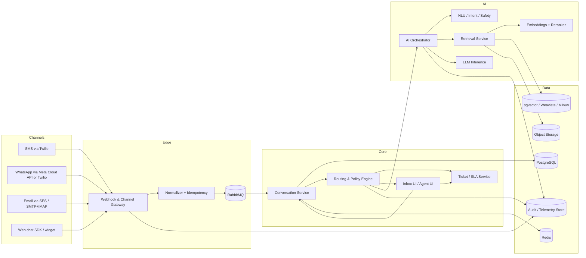
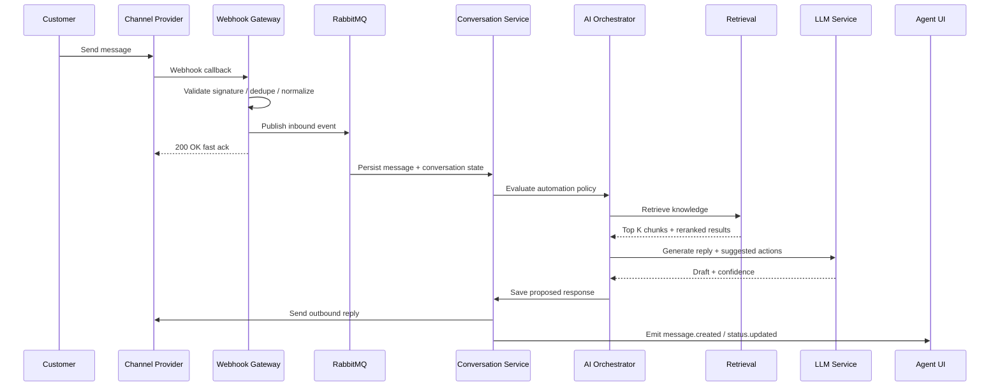
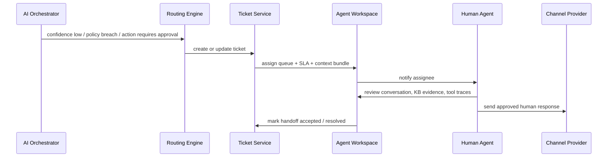

# Open-Source Architecture Blueprint for an Omnichannel AI Customer Support Agent

## Executive summary

There is not a single open-source project today that fully reproduces the end-to-end product surface of a Delight-style omnichannel AI support system out of the box. The closest practical path is to assemble a control-plane architecture around an open-source support workspace, a custom channel gateway, and a dedicated AI/RAG layer. Publicly visible Sendbird repositories show Delight-oriented sample code and docs, and the public Delight AI Agent repo describes omnichannel support across SMS, email, WhatsApp, in-app chat, web, and social channels, but it is not a turnkey open-source customer-support platform on its own. Chatwoot, by contrast, already provides a self-hostable omnichannel support foundation with website chat, email, SMS, WhatsApp, and API channels, plus deployable Docker and Kubernetes footprints. citeturn10view0turn22view0turn32view0turn24view0turn10view1turn10view3

The most implementable reference design is this: use **Chatwoot as the human inbox and agent workspace**, keep **PostgreSQL as the system of record**, use **Redis** for cache/session/idempotency, **RabbitMQ quorum queues** for operational async work, add a **custom channel normalization service** for email/SMS/WhatsApp/webhooks, and build a separate **AI orchestration service** that performs policy checks, retrieval, tool execution, human handoff, and audit logging. For retrieval, use **hybrid search** with dense vectors plus keyword search and reranking; for model serving, use **vLLM** for LLM inference and **Hugging Face Text Embeddings Inference** for embeddings and rerankers. This stack minimizes lock-in while staying close to the operational patterns documented by Chatwoot, Rasa, RabbitMQ, Kafka, Weaviate, Milvus, pgvector, and the major channel providers. citeturn34view0turn24view2turn21view0turn28search1turn21view6turn21view4turn10view4turn10view5turn21view1turn10view6turn10view8turn13view0

The key architectural principle is **event-driven determinism around probabilistic AI**. Channel ingress should be normalized into a canonical message envelope, persisted once, acknowledged quickly, and fanned out asynchronously. The AI layer should never directly “own” the conversation state. Instead, the conversation service owns truth; the AI service proposes actions; and policy/routing layers approve, reject, or escalate. That separation is what makes omnichannel continuity, observability, replay, and compliance implementable rather than aspirational. RabbitMQ’s acknowledgement and publisher-confirm semantics exist precisely for delivery/process safety, while Kafka’s retained event streams are better when you need durable replay and large-scale downstream analytics. citeturn10view9turn28search1turn28search0turn13view0

My recommendation is therefore:

- **Low-to-medium scale**: Chatwoot + custom AI services + PostgreSQL/pgvector + Redis + RabbitMQ.
- **High scale / high concurrency / heavier retrieval**: keep the same logical design, but graduate retrieval to Weaviate or Milvus, add Kafka for analytics/event replay, and split more services horizontally.
- **ML strategy**: start with prompt engineering, retrieval, reranking, and tool design; only fine-tune after you have a stable label taxonomy, high-quality transcripts, and measurable failure modes. The available open models already expose long context, structured output, and function-calling-friendly behavior, which is enough for a production-first support agent if orchestration is disciplined. citeturn10view7turn21view1turn10view6turn13view0turn30view1turn30view2turn30view3

## Assumptions and capacity tiers

The user explicitly left **message volume**, **latency SLOs**, and **budget** unspecified, so this blueprint treats them as open variables and provides design guidance by tier. The tiers below are engineering assumptions for capacity planning, not claims about provider limits.

| Tier | Monthly inbound messages | Interactive AI reply target | Typical concurrency | Budget guidance | Recommended posture |
|---|---:|---:|---:|---:|---|
| Low | up to 50k | p95 3–6 s for web chat/SMS; under 15 s for email | under 20 concurrent active turns | under \$3k/mo fixed infra before channel fees | Modular monolith + workers; pgvector; RabbitMQ; optional external LLM or burst GPU |
| Medium | 50k–500k | p95 2–4 s for web chat/SMS; under 10 s for email | 20–200 | \$3k–\$20k/mo before channel fees | Split channel gateway, conversation API, AI orchestrator, retrieval service; one dedicated inference tier |
| High | 500k+ to multi-million | p95 1.5–3 s for chat/SMS; under 5 s for email auto-drafts | 200+ | \$20k+/mo before channel fees | Kubernetes, managed DB/cache, dedicated GPU fleet, Weaviate/Milvus, Kafka for replay/analytics |

A practical set of architectural assumptions for a first production release is: multi-tenant support for several brands or queues, English-first with later multilingual expansion, durable omnichannel conversation continuity, agent handoff inside one workspace, knowledge retrieval over docs/FAQs/policies, and a human-review path for unsafe or low-confidence actions. Chatwoot’s documented conversation continuity between live chat and email is especially important here because it validates a production pattern in which outbound reply-to addresses and email threading metadata are used to keep one cross-channel thread coherent. citeturn24view1

The recommended SLO strategy is to separate **ingress SLOs** from **AI SLOs**. Accept and persist inbound channel events in well under one second, then drive classification/retrieval/generation asynchronously. This is aligned with how Twilio delivers incoming-message webhooks and status callbacks and how SES receiving plus SNS notifications can be processed programmatically. citeturn14view0turn14view1turn14view3turn14view4

## Reference architecture and component choices



This architecture deliberately separates **channel transport**, **conversation state**, and **AI decisioning**. It also leaves room to adopt an existing workspace instead of building every front-end from scratch. Chatwoot documents a production footprint of web servers, workers, PostgreSQL, Redis, email service, and object storage, which maps cleanly to the human-support side of this reference design. citeturn34view0turn34view2

### Component comparison table

| Layer | Recommended default | Alternatives | Strengths | Trade-offs |
|---|---|---|---|---|
| Human inbox / agent workspace | Chatwoot citeturn6search3turn24view0turn24view2turn10view3 | Zammad citeturn33view3turn33view2; FreeScout citeturn33view0turn33view1 | Fastest path to unified inbox, agent actions, APIs, web widget, self-hosting | Chatwoot is still a support platform, not an AI-first orchestration engine; FreeScout is email-first; Zammad is more ticket-centric |
| End-user chat SDK / polished in-app messaging | Sendbird UIKit repos citeturn22view0turn9search6 | Chatwoot client APIs / widget citeturn24view2turn6search0 | Strong option if you want a more custom in-app chat UX than a support widget | Not a full open-source helpdesk; best used as a client UI, not your support control plane |
| NLU, dialogue actions, rule-based workflows | Rasa Open Source + action server citeturn10view4turn10view5 | Pure LLM orchestration with your own policy service | Best OSS option when you need deterministic intents, rules, custom actions, and channel adapters | Rasa adds a second conversation framework; use it selectively, not as the sole system of record |
| LLM serving | vLLM citeturn21view6turn17search8 | Ollama for development / local ops citeturn21view7turn17search13 | High-throughput inference, cost-efficient serving, strong fit for production | More operationally involved than hosted APIs; Ollama is excellent for development but lighter-weight operationally |
| Embeddings and reranking | Hugging Face TEI + BGE-M3 / multilingual-e5-large + BGE reranker citeturn21view4turn21view5turn21view8turn21view9turn30view0 | all-MiniLM-L6-v2 for small English-only pilots citeturn21view10 | TEI supports embeddings and rerankers, dynamic batching, telemetry, air-gapped deploys | MiniLM truncates long inputs; multilingual-e5 is heavier; BGE-M3 adds flexibility but more complexity |
| Primary transactional store | PostgreSQL + JSONB + partitions + RLS citeturn27search2turn27search1turn27search0 | — | Best source of truth for conversations, tickets, users, and logs; strong multi-tenant controls | Needs careful indexing, partitioning, and data-lifecycle management |
| Vector store | pgvector for low/medium scale citeturn10view8 | Weaviate citeturn10view7turn21view1; Milvus citeturn10view6; Redis vectors/cache citeturn21view0 | pgvector keeps ops simple; Weaviate offers hybrid search/filtering; Milvus is strongest for large-scale vector workloads | Dedicated vector DBs add ops surface; pgvector is simpler but less purpose-built for very large ANN workloads |
| Queue / eventing | RabbitMQ quorum queues citeturn28search1turn10view9 | Kafka citeturn13view0 | RabbitMQ is better for operational jobs, work queues, retries, and acknowledgements | Kafka is better for replay, analytics fan-out, high-volume retained streams; more platform overhead |
| Object storage | S3-compatible object store and encrypted raw payload archive citeturn37search8 | MinIO / cloud-specific object storage | Cheap durable home for attachments, raw webhooks, knowledge files, exports | Requires lifecycle rules, encryption, and deletion workflows for compliance |

### Recommended reference stack

For most implementations, the best blueprint is:

- **Workspace**: Chatwoot.
- **Canonical data plane**: PostgreSQL + Redis.
- **Async jobs**: RabbitMQ quorum queues.
- **AI layer**: custom orchestration service; use Rasa only where deterministic intents/rules outperform a pure LLM policy.
- **Retrieval**: pgvector first; move to Weaviate or Milvus only when scale or hybrid-retrieval features justify it.
- **Serving**: vLLM for LLMs, TEI for embeddings/reranking.
- **Channels**: custom gateway for Twilio SMS, WhatsApp, SES/SMTP/IMAP, and web chat SDK/widget. citeturn34view0turn10view4turn10view5turn10view8turn10view7turn10view6turn21view6turn21view4

## Data model, APIs, and event flows

The canonical model should be designed around a **conversation ledger**, not provider-native message objects. External providers differ: Twilio webhooks are synchronous and form-encoded, SES inbound handling is email-native and notification-driven, and WhatsApp Business webhooks are JSON-based. Your internal representation should collapse all of them into one schema. citeturn14view0turn14view1turn14view3turn14view4turn5search0turn5search3turn5search4

### Canonical domain model

| Entity | Key fields | Notes |
|---|---|---|
| `accounts` | `id`, `name`, `region`, `retention_policy`, `kms_key_ref` | Tenant boundary |
| `users` | `id`, `account_id`, `role`, `email`, `status` | Human agents/admins |
| `contacts` | `id`, `account_id`, `external_refs`, `email`, `phone_e164`, `locale`, `consent_flags` | Store normalized identities; encrypt PII fields |
| `channels` | `id`, `account_id`, `type`, `provider`, `config_ref`, `status` | SMS, email, WhatsApp, web |
| `conversations` | `id`, `account_id`, `contact_id`, `primary_channel`, `status`, `owner_user_id`, `current_ticket_id`, `last_message_at` | One cross-channel thread |
| `messages` | `id`, `conversation_id`, `provider_message_id`, `direction`, `author_type`, `content_text`, `content_html`, `attachments_json`, `sent_at`, `ingested_at`, `raw_ref` | Unique index on `(channel_id, provider_message_id)` for idempotency |
| `tickets` | `id`, `conversation_id`, `queue`, `priority`, `sla_policy_id`, `status`, `handoff_reason` | Optional ticketing layer |
| `routing_decisions` | `id`, `conversation_id`, `rule_id`, `decision`, `score`, `reason` | Explainability for routing |
| `knowledge_documents` | `id`, `account_id`, `source_type`, `uri`, `version`, `checksum`, `visibility_scope` | Source of truth for KB |
| `knowledge_chunks` | `id`, `document_id`, `chunk_ix`, `text`, `embedding_ref`, `metadata_json` | Searchable retrieval units |
| `tool_calls` | `id`, `conversation_id`, `tool_name`, `request_json`, `response_json`, `status`, `latency_ms` | Every external action auditable |
| `audit_logs` | `id`, `account_id`, `actor_type`, `actor_id`, `action`, `object_type`, `object_id`, `before_json`, `after_json`, `ts` | Immutable-style append-only log |
| `delivery_attempts` | `id`, `message_id`, `channel_id`, `status`, `provider_status`, `attempt_no`, `ts` | Retries and downstream diagnostics |
| `embeddings` | `id`, `model_name`, `dimension`, `vector`, `created_at`, `delete_tombstone` | Keep model/version explicit |

For multi-tenant SaaS, use **PostgreSQL row-level security** for account scoping and **declarative partitioning** for high-volume tables such as `messages`, `audit_logs`, and `delivery_attempts`. PostgreSQL documents both RLS and table partitioning directly, and logical replication is useful when you want to offload CDC into analytics or a search pipeline without coupling the primary OLTP database to reporting workloads. citeturn27search1turn27search2turn27search0turn27search4

A retrieval-friendly ingestion model should store **document metadata separately from chunks**, with chunk size tuned by corpus type. For FAQs and policies, 300–800 token chunks usually win. For product docs and long procedures, chunk hierarchically: parent section, child chunk, plus breadcrumbs. If you use BGE-M3 or similar hybrid-capable embeddings, keep sparse/keyword signals available alongside dense vectors; then rerank top candidates with a cross-encoder such as BGE Reranker. The BGE-M3 model card explicitly positions hybrid retrieval as a strong RAG pattern, and the reranker model cards describe cross-encoder relevance scoring for second-pass ranking. citeturn21view8turn30view0turn10view7

### Sequence diagram for automated resolution



This flow is intentionally “ack fast, work later.” Twilio’s webhook model supports this pattern directly, and RabbitMQ’s acknowledgement model is designed for precisely this kind of delivery-safety boundary. citeturn14view0turn14view1turn10view9

### Sequence diagram for human handoff



The important implementation detail is that handoff must carry **conversation summary, retrieved evidence, tool-call transcript, confidence score, and failure reason**. Otherwise agents receive a cold transfer instead of a warm one.

### Sample normalized API contracts

The following are **internal** contracts. They are intentionally provider-neutral even though upstream providers differ in payload format.

**Message ingestion endpoint**

```json
POST /v1/messages:ingest
{
  "idempotency_key": "twilio:SMXXXXXXXXXXXXXXXX",
  "account_id": "acct_123",
  "channel": {
    "type": "sms",
    "provider": "twilio",
    "channel_id": "ch_sms_support"
  },
  "provider_event": {
    "provider_message_id": "SMXXXXXXXXXXXXXXXX",
    "provider_thread_id": "+15551234567",
    "received_at": "2026-04-28T16:12:07Z",
    "raw_ref": "s3://raw-events/2026/04/28/twilio/SMXXXXXXXXXXXXXXXX.json"
  },
  "contact": {
    "external_id": "+15551234567",
    "phone_e164": "+15551234567",
    "email": null,
    "display_name": null,
    "locale": "en-US"
  },
  "message": {
    "direction": "inbound",
    "content_type": "text/plain",
    "text": "Where is my order?",
    "attachments": []
  },
  "routing_hints": {
    "brand": "main",
    "queue": "orders",
    "priority": "normal"
  }
}
```

**Ingestion response**

```json
200 OK
{
  "status": "accepted",
  "conversation_id": "conv_9f2c",
  "message_id": "msg_a8d1",
  "dedupe": false
}
```

**AI reply contract**

```json
POST /v1/agent/replies
{
  "conversation_id": "conv_9f2c",
  "author": {
    "type": "ai_agent",
    "id": "agent_support_v1"
  },
  "reply": {
    "text": "I found your order. It left the warehouse today and is scheduled for delivery on Thursday.",
    "format": "plain_text"
  },
  "evidence": [
    {
      "document_id": "kb_shipping_policy_v12",
      "chunk_id": "chunk_1882",
      "score": 0.93
    }
  ],
  "decision": {
    "confidence": 0.92,
    "mode": "auto_send",
    "handoff_required": false
  },
  "tool_calls": [
    {
      "tool": "order_lookup",
      "status": "succeeded",
      "latency_ms": 184
    }
  ]
}
```

**Event to inbox UI / integrations**

```json
POST /webhooks/message.created
{
  "event_id": "evt_01964",
  "event_type": "message.created",
  "occurred_at": "2026-04-28T16:12:09Z",
  "account_id": "acct_123",
  "conversation_id": "conv_9f2c",
  "message_id": "msg_a8d1",
  "author_type": "ai_agent",
  "channel": "sms",
  "status": "sent"
}
```

In production, provider adapters should then map upstream specifics into this contract:

- Twilio inbound delivery: form-encoded webhook data, synchronous callback, plus outbound status callbacks. citeturn14view0turn14view1
- SES inbound email: rule-based domain receiving, spam/virus checks, then downstream JSON notifications. citeturn14view3turn14view4
- WhatsApp Cloud API: JSON webhooks for inbound/status events and the Messages API for outbound service messages; Meta documents Cloud API as the preferred path versus the sunset on-premises API. citeturn5search0turn5search3turn5search4turn3search3turn3search1

## Deployment, scaling, and cost

A pragmatic deployment progression is:

- **Pilot / low tier**: Docker Compose or a small Kubernetes cluster. Run Chatwoot, your custom gateway, conversation API, AI orchestrator, RabbitMQ, PostgreSQL, Redis, TEI, and object storage integration. Chatwoot officially supports Docker, Linux VMs, Kubernetes, and major cloud providers; its production guide lists web servers, workers, PostgreSQL, Redis, email service, and object storage. citeturn10view1turn10view3turn34view0turn34view2
- **Medium tier**: Kubernetes, separate deployments for `channel-gateway`, `conversation-api`, `router`, `ai-orchestrator`, `retrieval-api`, `embedder-worker`, `outbound-dispatcher`, and `ticket-sync`. Keep TEI and vLLM in their own node pools; isolate GPU workloads from web/API pods. TEI explicitly supports Docker, local CPU, Apple Silicon, air-gapped deployment, distributed tracing, and Prometheus metrics. citeturn21view4turn21view5
- **High tier**: multi-AZ Kubernetes, managed PostgreSQL and Redis, RabbitMQ for operational workflows, Kafka for retained event streams/analytics, separate online and offline retrieval pipelines, blue/green or canary inference rollouts, and region-local SMS/WhatsApp ingress if data residency matters. Kafka’s documentation emphasizes retained streams, distributed scalability, partitioning, replication, and decoupled producers/consumers, which is why it belongs in the high-scale analytics/replay tier rather than the initial operational queue tier. citeturn13view0

### Scaling and performance guidance

The first real bottlenecks in this system will not be the inbox UI; they will be **webhook spikes**, **LLM latency**, **retrieval tail latency**, and **database writes to the message ledger**. The corresponding countermeasures are straightforward:

- **Webhook spikes**: terminate ingress quickly and publish to queue; never block provider callbacks on AI generation. citeturn14view0turn14view1turn10view9
- **Operational retry safety**: use RabbitMQ publisher confirms, manual consumer acknowledgements, and quorum queues for critical ingestion and dispatch workloads. citeturn10view9turn28search1
- **Read-heavy history lookups**: cache conversation headers and hot thread windows in Redis; keep full history in PostgreSQL.
- **Message table growth**: partition by time and optionally `account_id`; archive raw payloads and large attachments to object storage. citeturn27search2turn37search8
- **Cross-channel continuity**: key all threading on canonical `conversation_id` and store channel-specific thread identifiers as secondary attributes.
- **Retrieval accuracy**: start with hybrid search plus reranking; do not expose vector-only retrieval directly to generation. Weaviate explicitly documents keyword, vector, and hybrid search, and BGE-M3 explicitly recommends hybrid retrieval for RAG. citeturn10view7turn21view8turn30view0
- **Model concurrency**: separate lightweight classifiers from draft-generation models; avoid routing every message to the largest model.

### Microservices vs modular monolith

For an engineering team of normal size, a **modular monolith with asynchronous workers** is the right starting point. Keep separate deployables only where the runtime profile is fundamentally different:

- channel gateway
- inference services
- retrieval/indexing pipeline
- human workspace

Everything else can begin life as modules inside one application or one repo. A hard microservice split from day one will slow delivery without materially improving safety.

### Cost model and trade-offs

The strongest fixed-cost lesson is simple: **dedicated GPU inference dominates total cost far earlier than web/API infrastructure does**. AWS’s public EC2 On-Demand page currently shows `t4g.large` at \$0.0672/hour, which is roughly \$49/month per node if run continuously. By contrast, a current AWS post on SageMaker G7e inference cites `ml.g7e.2xlarge` at \$4.20/hour, or about \$3,066/month for a 24/7 dedicated inference endpoint. That means low-tier deployments should avoid always-on GPU endpoints unless the ticket volume justifies them. citeturn16search0turn36view0

Channel costs are also straightforward and should be treated as variable pass-throughs. Twilio’s pricing page currently lists SMS starting at \$0.0083 per sent/received message and WhatsApp at \$0.005 per message, with Meta template fees layered separately for WhatsApp. SES currently lists outbound email at \$0.10/1,000 emails and inbound at \$0.10/1,000 emails plus incoming mail-chunk charges; AWS’s own pricing examples give a concrete 250,000-outbound / 1,000-inbound scenario of \$25.77/month. citeturn15search4turn15search1turn14view5

An illustrative monthly envelope, excluding labor:

| Tier | Platform shape | Illustrative monthly envelope |
|---|---|---|
| Low | 2 app nodes, PostgreSQL, Redis, RabbitMQ, object storage, TEI on CPU, no always-on GPU | **Low hundreds to low thousands** before channel fees; add SMS/email variable usage |
| Medium | 3–6 app/worker nodes, managed DB/cache, TEI, one dedicated or burst LLM tier | **Roughly \$3k–\$10k+** before channel fees, depending on whether dedicated GPU is always-on |
| High | multi-AZ K8s, managed DB/cache, Kafka optional, dedicated retrieval cluster, multiple inference endpoints | **Five figures and up** before channel fees |

The major trade-offs are:

- **pgvector vs dedicated vector DB**: simpler ops vs more headroom/features.
- **RabbitMQ vs Kafka**: operational queue simplicity vs retained replay/analytics power.
- **Self-hosted models vs hosted APIs**: better privacy/control vs higher MLOps and GPU cost.
- **Chatwoot-led workspace vs fully custom UI**: faster delivery vs less differentiated UX.

## Security, privacy, observability, and compliance

Security should be designed as a first-class dataflow property, not a bolt-on. Channel ingress is the first trust boundary. Twilio signs inbound requests with `X-Twilio-Signature` using HMAC-SHA1 over the exact request URL and parameters, so signature validation should be enforced at the gateway before any message is accepted. If you use SES for inbound email, SES handles mail-receiving operations including spam and virus scanning before you process the message. citeturn14view2turn14view3

### Security checklist

- [ ] Validate provider signatures and verify webhook challenges at the edge.
- [ ] Enforce mTLS or private service networking between gateway, conversation API, and AI services.
- [ ] Encrypt all transport with TLS and all persisted data at rest.
- [ ] Use **field-level encryption** or tokenization for phone numbers, email addresses, shipping addresses, order IDs, and attachment OCR text.
- [ ] Keep **raw provider payloads** in encrypted object storage with lifecycle rules and minimal retention.
- [ ] Store **embeddings separately from raw PII**; prefer redacted or PII-light chunks in the vector index.
- [ ] Use RBAC for users and queue-level permissions, backed by database row-scoping for tenants. The NIST RBAC project remains the canonical reference for role-based access control, and PostgreSQL documents row-level security natively. citeturn20view8turn27search1
- [ ] Maintain immutable-style **audit logs** for view/export/delete/reply/assignment/tool-call events. NIST describes audit trails as a mechanism for accountability and reconstruction of events, and OWASP explicitly recommends application logging for security events and audit-trail use cases. citeturn20view9turn20view6
- [ ] Implement secret rotation for channel credentials, model backends, and database users.
- [ ] Add outbound DLP/redaction policies so AI-generated replies do not leak internal notes or sensitive customer data.
- [ ] Require human approval for irreversible actions such as refunds, cancellations, account closures, or regulated disclosures.

### Compliance mapping

This is an engineering mapping, not legal advice. For GDPR-aligned operations, the most important technical controls are data inventory, scoping, exportability, and deletion. The European Commission’s GDPR explanation emphasizes rights including access, rectification, erasure, portability, objection, and restrictions on profiling; Article 17 specifically establishes the right to erasure. citeturn20view7turn8search3

| Requirement | Engineering control |
|---|---|
| Right of access / portability | Export conversation history, ticket state, audit trail, and attachments as JSON/CSV bundle keyed by contact or account |
| Right to erasure | Cascading delete or irreversible redaction across PostgreSQL rows, raw objects, search index documents, and embeddings; maintain tombstones so deleted chunks are not re-indexed |
| Data minimization | Do not index raw payloads or agent-screen telemetry by default; keep only fields needed for support and compliance |
| Purpose limitation | Separate “support operations” data from “model evaluation / fine-tuning” datasets with explicit opt-in flags |
| Auditability | Immutable append log for administrative access, exports, deletions, tool calls, and agent overrides |
| Tenant isolation | RBAC + queue permissions + database row security + per-tenant KMS keys in regulated environments |

### Observability stack

Use **OpenTelemetry** as the telemetry standard across services, **Prometheus** as the metrics store and alert source, and **Grafana** to provision dashboards and alerts as code. OpenTelemetry documents traces, metrics, and logs as a unified framework; Prometheus recommends instrumenting everything; Grafana documents filesystem/YAML provisioning for data sources, dashboards, and alerting. citeturn20view0turn20view1turn20view2turn20view3turn20view4

### Recommended dashboards and alert thresholds

| Dashboard | Must-have measures | Recommended alert threshold |
|---|---|---|
| Channel ingress | webhook 2xx rate, signature failures, p95 ingest latency, dedupe hits, dropped events | 2xx rate under 99.9% over 5 min; p95 ingest over 500 ms for 15 min; signature failures spike above baseline |
| Queue health | queue depth, oldest message age, redeliveries, consumer capacity, publish/ack rate | oldest message age over 30 s for low/medium tier; redelivery rate over 1%; consumer capacity under 80% for sustained periods |
| Conversation core | p95 write latency, read latency, thread-merge rate, conversation reopen rate | p95 DB write over 50 ms sustained; reopen rate doubles week-over-week |
| AI performance | retrieval p95, reranker p95, LLM TTFT, tokens/sec, tool-call latency, confidence distribution | generation p95 over 4 s low tier or 2.5 s high tier; tool failure over 2%; sudden confidence collapse |
| Retrieval quality | top-k hit rate on eval set, citation coverage, empty-result rate, index freshness | empty-result rate over 3%; index freshness lag over 30 min |
| Human handoff | handoff rate, queue backlog, first-human-response time, approval-required rate | first-human-response SLO breach over 5% of tickets; queue backlog age over SLA threshold |
| Customer outcomes | auto-resolution rate, containment rate, CSAT, reopen rate, escalation rate | auto-resolution drops 15% week-over-week; CSAT drops 10% week-over-week |
| Security / compliance | export events, delete events, admin escalations, unusual access, PII redaction misses | any failed DSR job; any unauthorized admin action; sudden spike in export volume |

## Implementation roadmap and checklist

The roadmap below assumes **2–3 engineers** with pragmatic reuse of existing OSS rather than full custom UI development from day one.

| Milestone | Deliverable | Estimated effort |
|---|---|---:|
| Foundation | Repo, CI/CD, environment config, secrets, Docker/K8s manifests, database bootstrap, tenant model | 24–40 hours |
| Canonical data model | PostgreSQL schema, idempotency keys, message ledger, contact identity merging, audit log entities | 32–48 hours |
| Channel ingress | Twilio SMS webhook adapter, SES or IMAP email ingress, web chat ingress, outbound dispatchers | 48–80 hours |
| Human workspace | Chatwoot deployment, inbox mapping, agent auth/roles, queue setup, conversation linking | 24–48 hours |
| Routing and ticketing | SLA queues, priority rules, handoff triggers, ownership model, escalation workflow | 24–40 hours |
| Knowledge ingestion | document loader, chunker, embeddings pipeline, vector index, reranking, index freshness job | 40–64 hours |
| AI orchestration | intent/safety precheck, retrieval chain, tool-calling, response policy, approval gates | 56–96 hours |
| Agent UI augmentations | AI side panel, evidence viewer, tool-call transcript, approve/edit/send workflow | 32–56 hours |
| Observability and security | OTel/Prometheus/Grafana, audit reports, webhook signature validation, PII redaction, backups | 40–72 hours |
| Performance and go-live | load tests, replay tests, failover drills, runbooks, canary release, rollback playbooks | 32–56 hours |

A realistic first production system therefore lands around **352–600 engineering hours**, depending on how much UI you build yourself and whether you self-host models immediately or start with a hybrid path.

### Step-by-step deployment checklist

- [ ] Choose tenant model: single-tenant per customer, or shared multi-tenant.
- [ ] Stand up PostgreSQL, Redis, RabbitMQ, object storage, and secrets manager.
- [ ] Deploy Chatwoot or your chosen human workspace.
- [ ] Implement the canonical message-ingestion API and provider idempotency.
- [ ] Add Twilio SMS inbound/outbound connector.
- [ ] Add email ingress using SES receiving or IMAP polling plus SMTP/transactional outbound.
- [ ] Add WhatsApp adapter using Meta Cloud API or Twilio WhatsApp.
- [ ] Add web chat SDK/widget and anonymous-to-known user merge flow.
- [ ] Implement conversation routing and handoff rules.
- [ ] Build knowledge ingestion, chunking, embeddings, and reranking.
- [ ] Expose AI orchestration with approval gates and tool-call tracing.
- [ ] Instrument every service with OTel, Prometheus metrics, and structured logs.
- [ ] Add dashboards and paging rules.
- [ ] Add DSR export/delete pipeline and test erasure in DB, object storage, and vector index.
- [ ] Load test ingress spikes, queue backlogs, and model concurrency.
- [ ] Run canary traffic and a rollback drill before production.

**Open questions / limitations**

This report is intentionally implementation-oriented, but five choices still determine the final design shape: whether you want **single-tenant or multi-tenant isolation**, whether the system of record for ticketing must remain external, which **regions/data-residency** constraints apply, whether you need **multilingual support on day one**, and whether model hosting must be **fully self-managed** or can be hybrid. The blueprint above is robust under all of those cases, but the precise component choices change with them.