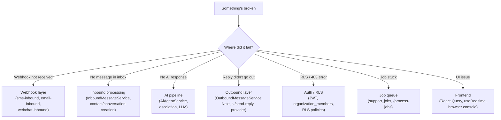

# Debugging

> A field guide to diagnosing common issues in development and production.

## Triage: where is the failure?



## Webhook layer

### "Could not determine organization for receiving phone number"

The inbound phone number is not registered in `sms_phone_numbers` (or for email, the email isn't in `email_addresses`).

**Fix**: Either
- Add the number/address in Settings → Channels, or
- Insert directly: `INSERT INTO sms_phone_numbers (provider_account_id, organization_id, phone_number) VALUES (...)`.

The function derives the organization from the configured receiving number/address and requires that route's account to match `x-provider`. Caller-supplied organization headers are ignored; add or correct the receiving route instead.

### "Webhook signature verification failed"

The request signature does not match the stored provider credentials resolved through the receiving number/address or outbound message. For local-only mock testing, set `INBOXPILOT_ALLOW_LOCAL_MOCK_WEBHOOKS=true`, use loopback request and InsForge base URLs, and send `x-provider: mock`. Deployed endpoints always reject the mock adapter.

### "Unknown SMS provider: <name>"

The function entrypoint doesn't have an adapter registered for that `x-provider` value. Edit `insforge/functions/sms-inbound/index.ts` to add `registry.registerSmsAdapter(name, new XAdapter())`.

## Inbound processing

### Duplicate messages despite unique constraint

The dedup index is **partial**: it only enforces uniqueness when `provider IS NOT NULL AND external_message_id IS NOT NULL`. If either is null, dedup won't catch it. Check the row that was inserted:

```sql
SELECT id, provider, external_message_id FROM messages
WHERE body = '<body>' ORDER BY created_at DESC LIMIT 5;
```

## AI pipeline

### "AI processing failed"

Check the `ai_decisions` table for the latest decision on the conversation:

```sql
SELECT id, decision_type, confidence, reasoning_summary, raw_response, created_at
FROM ai_decisions
WHERE conversation_id = 'uuid'
ORDER BY created_at DESC LIMIT 3;
```

`raw_response` contains either the parsed LLM response or the error. Common causes:
- OpenRouter key missing/invalid in the InsForge project's AI settings.
- Model name in `ai_settings.model` is invalid (default is `openai/gpt-5-mini`; `AiAgentService` falls back to `DEFAULT_CHAT_MODEL` from `packages/support-core/src/types/ai-models.ts` when the DB value is empty or not in `CHAT_MODEL_OPTIONS`).
- The embedding model is configured per-org in `ai_settings.embedding_model` (default `openai/text-embedding-3-small`). Changing it requires re-indexing the knowledge base; until then, similarity scores may degrade.
- LLM returned invalid JSON (will be in `raw_response.raw` with `error: "Schema validation failed: ..."`).

### "AI skipped with reason: missing_knowledge"

No knowledge chunks matched the message above the similarity threshold. Either:
- The org has no knowledge documents (or they're all `status != 'ready'`).
- The document content doesn't match the question.
- `ai_settings.knowledge_similarity_threshold` is too high (default 0.70).

Verify with:

```sql
SELECT id, title, status FROM knowledge_documents WHERE organization_id = 'uuid';
SELECT id, document_id, content FROM knowledge_chunks WHERE organization_id = 'uuid' LIMIT 5;
```

If the doc is in `pending` or `processing`, check the `support_jobs` table for a stuck `process_knowledge_document` job.

### "AI decided to escalate, but I don't know why"

The escalation reason is in `ai_decisions.raw_response.escalationRule` (and the human-readable reason in `reasoning_summary`). Common rules:
- `HumanRequestRule` — the customer asked for a human
- `ProfanityAngerRule` — strong language
- `SensitiveTopicRule` — legal/refund/cancellation
- `SafetyConcernRule` — security/medical/safety
- `MissingKnowledgeRule` — no KB chunks matched
- `RepeatedFailureRule` — consecutive AI failures exceeded
- `KeywordRule` — custom org-configured keyword

## Outbound layer

### "Reply sent" but the customer never received it

Check the channel-specific delivery path:
- **SMS / email** — `send-reply` and AI-draft approval load the configured default route, resolve its provider credentials, and call the provider adapter before recording the outbound result. Check the provider account/route, stored secret, adapter response, and resulting `delivery_status`.
- **Webchat** — the message is recorded and published on `widget:{widgetId}:{visitorTokenJti}` via InsForge Realtime. If the visitor doesn't see it, check the channel and the visitor's JWT.

Check the audit log:

```sql
SELECT * FROM audit_logs WHERE resource_id = '<message-id>' AND action = 'message_sent';
```

### "No default SMS phone number configured for organization"

Add a row to `sms_phone_numbers` with `is_default = true` (and ensure only one row per org has `is_default = true`).

## Auth / RLS

### "new row violates row-level security policy"

The current user is not a member of the target organization. Verify:

```sql
SELECT * FROM organization_members WHERE user_id = '<user-id>';
```

If the user should be a member, add them:

```sql
INSERT INTO organization_members (organization_id, user_id, role)
VALUES ('<org-id>', '<user-id>', 'agent');
```

### "Failed to fetch user"

The JWT has no `sub` claim. Check that:
- The token is being sent (`Authorization: Bearer <token>` or `insforge_access_token` cookie).
- The token hasn't expired (InsForge tokens are short-lived by default).
- The user actually exists in InsForge auth.

For the Next.js API routes, the local JWT decoder in `app/api/functions/_auth.ts` reads `payload.sub || payload.id`.

## Job queue

### Jobs stuck in `pending`

- The InsForge cron/scheduler may not be running. Check the function logs for the InsForge environment.
- Trigger manually with `POST /functions/v1/process-jobs`, body `{}`, and the
  server-only `X-Process-Jobs-Secret: <PROCESS_JOBS_SECRET>` header.
- Or send the same authenticated POST to `${FUNCTIONS_URL}/process-jobs` from the server.

### Job in `failed` with backoff

This is normal — `run_after` is in the future, and `process-jobs` will re-claim it once that time passes. To force retry: `UPDATE support_jobs SET run_after = now(), status = 'pending' WHERE id = 'uuid';`.

### Job in `dead`

`attempts >= max_attempts`. The job is dead-lettered; it won't be re-claimed. Inspect `last_error`, fix the underlying cause, then re-enqueue:

```sql
INSERT INTO support_jobs (organization_id, job_type, payload)
VALUES ('<org-id>', '<job-type>', '<payload-json>'::jsonb);
```

### "claim_support_jobs returned 0 jobs"

Either all jobs are already `claimed` (currently being processed) or `run_after` is in the future. Wait or manually adjust.

## Frontend

### Page is blank

1. Open browser DevTools → Console. Check for uncaught errors.
2. Check Network tab — are queries returning 200? Is auth resolving (`getCurrentUser` succeeding)?
3. Check React Query DevTools (or the network tab for `/api/database/...` requests). Are they returning data?

### useRealtime not firing

- Verify the channel name matches what the server publishes. The function publishes on `org:{orgId}`; the hook's `conversationChannel` should be that exact string.
- Check that `insforge.realtime.connect()` succeeded (look for it in the browser console).
- Some browser extensions block WebSocket connections — try in an incognito window.

### React Query data is stale

`staleTime: 30_000` is the default. To force refetch: invalidate the query key from another part of the code, or call `.invalidateQueries({ queryKey: queryKeys.messages(id) })` from a useRealtime callback.

## Logs

Use the InsForge dashboard or `get-container-logs` MCP tool:

- `function.logs` — Deno function execution logs (look for `console.error` from catch blocks).
- `postgREST.logs` — database query logs.
- `postgres.logs` — Postgres logs (slow queries, RLS denials).

For Next.js API routes, check your platform's logs (Vercel, etc.) or run `npm run dev` locally to see them in the terminal.

## Useful diagnostic queries

```sql
-- Recent errors in dead jobs
SELECT * FROM support_jobs WHERE status = 'dead' ORDER BY updated_at DESC LIMIT 10;

-- All failed jobs
SELECT * FROM support_jobs WHERE status = 'failed' AND run_after <= now() ORDER BY run_after LIMIT 20;

-- Conversations with no messages (orphans)
SELECT c.id, c.created_at FROM conversations c
LEFT JOIN messages m ON m.conversation_id = c.id
WHERE m.id IS NULL;

-- AI decisions with low confidence (potential misclassifications)
SELECT * FROM ai_decisions
WHERE organization_id = 'uuid' AND confidence < 0.5
ORDER BY created_at DESC LIMIT 20;

-- Audit log for a specific message
SELECT * FROM audit_logs
WHERE resource_id = '<message-id>' OR metadata->>'messageId' = '<message-id>'
ORDER BY created_at DESC;
```
