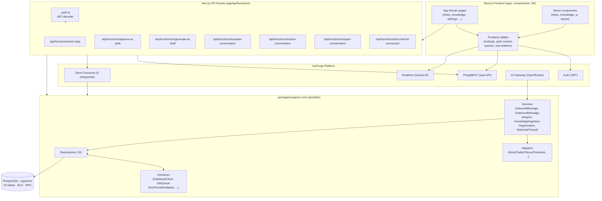
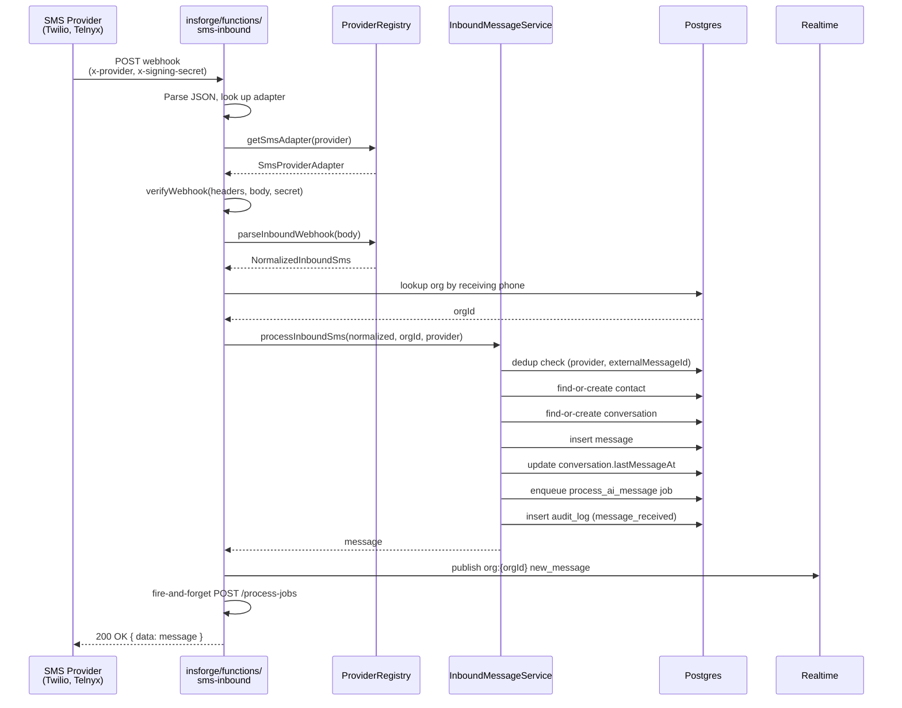
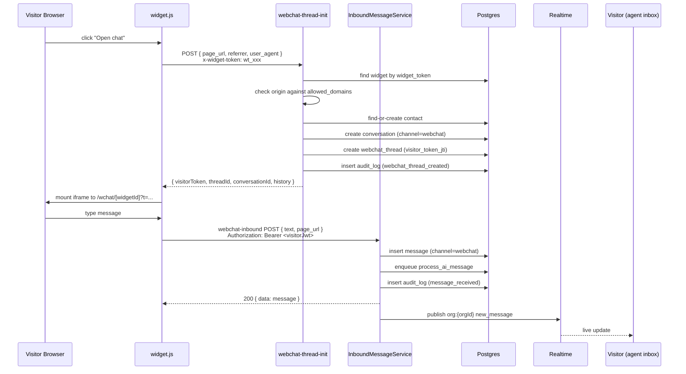
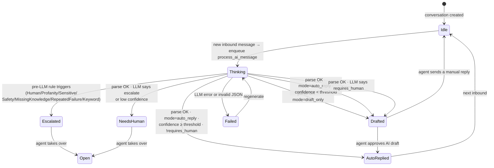
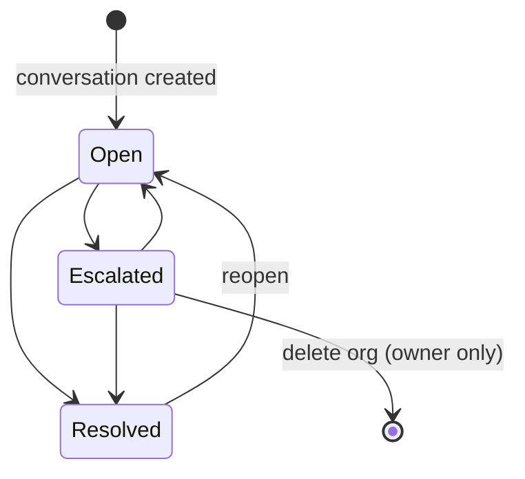
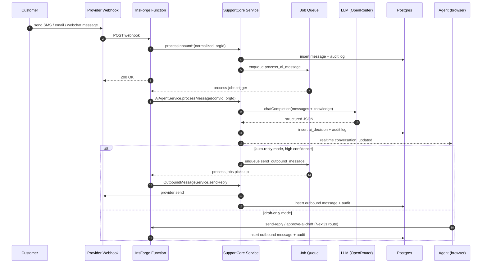

# Architecture

> Source of truth for the system's structure, layered design, data flow, and key invariants. If other docs contradict this file, this file wins — and the other doc should be updated.

## System overview

InboxPilot is a multi-tenant AI customer support platform. It handles inbound and outbound communication over three channels (SMS, email, web chat), uses AI to draft and auto-reply to messages, and escalates sensitive conversations to human agents. All business logic lives in a standalone package (`packages/support-core/`) that never imports the InsForge SDK; external dependencies are injected via TypeScript interfaces.

### Design principles

1. **Portability** — Business logic is backend-agnostic. Migrating to another BaaS or self-hosted Postgres requires only new interface implementations, not business-logic changes.
2. **Layered architecture** — Clear separation between entrypoints, services, repositories, and adapters with strict dependency rules.
3. **Deterministic safety** — Escalation rules run before any LLM call. Sensitive conversations never reach the AI.
4. **Multi-tenancy by default** — Every tenant-scoped table is protected by Row Level Security policies that read JWT claims at the database level.
5. **Auditability** — All significant actions are logged to an append-only `audit_logs` table.
6. **Idempotent queues** — Job enqueue is idempotent on `(job_type, key-payload-fields)`. Inbound message processing is idempotent on `(provider, external_message_id)`.

---

## Component diagram

---

## Layered architecture

| Layer | Location | Responsibility | May import |
|---|---|---|---|
| **Frontend pages & components** | `app/`, `components/` | UI rendering, auth gating, data fetching via React Query | `lib/`, `@insforge/sdk` |
| **Frontend data layer** | `lib/queries.ts`, `lib/auth-context.tsx`, `lib/use-realtime.ts`, `lib/insforge.ts`, `lib/insforge-admin.ts` | Auth context, query hooks, realtime subscriptions, server-side admin client | `@insforge/sdk` |
| **Next.js API Routes** | `app/api/functions/*/route.ts` | JWT-authed actions (send-reply, approve-ai-draft, …) — short, direct to DB; primarily thin wrappers for non-business-logic operations | `@insforge/sdk` (via `insforgeAdmin`) |
| **InsForge Deno Functions** | `insforge/functions/*/index.ts` | Webhook receivers, internal job runner — parse request, wire adapters, delegate to support-core | `support-core` (can import everything in it) |
| **Service layer** | `packages/support-core/src/services/` | Business logic orchestration: inbound processing, AI pipeline, outbound sending, RBAC, knowledge ingestion, webchat thread lifecycle | repositories, interfaces, types, utils |
| **Repository layer** | `packages/support-core/src/repositories/` | Data access abstraction — CRUD on entities via `DatabaseClient` interface, snake_case ↔ camelCase mapping | interfaces, types |
| **Adapter layer** | `packages/support-core/src/adapters/` | Provider-specific integrations for SMS (Twilio, Telnyx, mocks, stubs) and email (Postmark, mocks, stubs) | interfaces, types |
| **Interface layer** | `packages/support-core/src/interfaces/` | TypeScript contracts (`DatabaseClient`, `SmsProviderAdapter`, `EmailProviderAdapter`, `JobQueue`, `AiClient`, `RealtimePublisher`, `ProviderRegistry`, `EscalationEngine`, …) | types only |
| **Type layer** | `packages/support-core/src/types/` | Shared entity types, enums, input/output shapes | nothing |

### Dependency rules

- **`packages/support-core/` MUST NOT import `@insforge/sdk`** or any InsForge-specific code. All external dependencies are injected via interfaces.
- Layers depend strictly downward: `entrypoints → services → repositories → interfaces → types`.
- Adapters depend only on interfaces and types, not on services or repositories.
- The function entrypoint layer is the only place where InsForge SDK and concrete adapter wiring happens.
- The frontend and Next.js API routes are the only places that may import `@insforge/sdk` directly.

---

## Data flow diagrams

### Inbound SMS

### Web chat — visitor session lifecycle

### AI processing pipeline

### Conversation status state machine

### End-to-end inbound → AI → reply (channel-agnostic)

---

## Channel matrix

| Channel | Inbound entrypoint | Outbound via | Identity model | Org lookup |
|---|---|---|---|---|
| **SMS** | `insforge/functions/sms-inbound` | `OutboundMessageService` → `SmsProviderAdapter.sendSms` | Contact by phone (E.164) | `sms_phone_numbers.phone_number → organization_id` |
| **Email** | `insforge/functions/email-inbound` | `OutboundMessageService` → `EmailProviderAdapter.sendEmail` | Contact by email | `email_addresses.email_address → organization_id` |
| **Web chat** | `insforge/functions/webchat-inbound` | Realtime push to `widget:{widgetId}:{visitorTokenJti}` (no provider) | Visitor JWT (HS256, per-widget secret) | `webchat_widgets.widget_token → organization_id` |

All three channels use the same `conversations` and `messages` tables (the `channel` column is `'sms' | 'email' | 'webchat'`). All three reuse the same `process_ai_message` job and `AiAgentService`.

---

## Services (12)

| Service | File | Responsibility |
|---|---|---|
| `InboundMessageService` | `services/inbound-message-service.ts` | Process inbound SMS / email / webchat: dedup, find-or-create contact/conversation, insert message, enqueue AI job, audit log |
| `OutboundMessageService` | `services/outbound-message-service.ts` | Send outbound SMS / email / webchat reply: load conversation, dispatch by channel, insert message, audit log |
| `AiAgentService` | `services/ai-agent-service.ts` | AI pipeline: load settings + history + knowledge, evaluate pre-LLM escalation, call LLM, parse JSON decision, post-LLM confidence check, mode gating (draft_only vs auto_reply), audit log |
| `KnowledgeIngestionService` | `services/knowledge-ingestion-service.ts` | Chunk a document, generate embeddings, store chunks; mark ready / failed with audit log |
| `WebchatThreadService` | `services/webchat-thread-service.ts` | Webchat thread init (anonymous contact + conversation + thread), identify (rotate JTI), audit log |
| `OrganizationService` | `services/organization-service.ts` | Create org + owner, invite members, change role (single-owner invariant), remove members; audit log |
| `PostgresJobQueue` | `services/postgres-job-queue.ts` | Enqueue (idempotent), claim, complete, fail (exponential backoff, dead-lettering) |
| `RbacService` (helpers) | `services/rbac.ts` | `hasPermission`, `checkPermission`, `ROLE_PERMISSIONS` |
| `AiDecisionParser` (helpers) | `services/ai-decision-parser.ts` | Zod schema + `parseAiDecision` for the structured LLM JSON |
| `EscalationRule` impls (8) | `services/escalation-rules.ts` | HumanRequest, ProfanityAnger, SensitiveTopic, SafetyConcern, MissingKnowledge, LowConfidence, RepeatedFailure, Keyword; plus `createDefaultEscalationEngine` |

(See [`reference/rbac.md`](rbac.md), [`reference/jobs.md`](jobs.md), [`reference/audit.md`](audit.md) for cross-service references.)

---

## Repositories (16)

| Repository | Table(s) | Key methods |
|---|---|---|
| `OrganizationRepository` | `organizations` | create, findById, list |
| `MemberRepository` | `organization_members` | create, update, delete, listByOrg, findByUser |
| `ContactRepository` | `contacts` | create, update, findById, findByPhone, findByEmail, list |
| `ConversationRepository` | `conversations` | create, update, findById, findOpenByContactAndChannel, listByOrg |
| `MessageRepository` | `messages` | create, findByExternalId, updateDeliveryStatus, listByConversation |
| `AiSettingsRepository` | `ai_settings` | findByOrg, upsert |
| `AiDecisionRepository` | `ai_decisions` | create, listByConversation, latestForConversation |
| `KnowledgeRepository` | `knowledge_documents`, `knowledge_chunks` | createDocument, getDocument, updateDocument, deleteDocumentWithChunks, insertChunks, deleteChunksByDocument, **matchChunks** (RPC) |
| `SmsProviderAccountRepository` | `sms_provider_accounts`, `sms_phone_numbers` | create, listByOrg, findDefaultPhoneNumber, findById |
| `EmailProviderAccountRepository` | `email_provider_accounts`, `email_addresses` | create, listByOrg, findDefaultEmailAddress, findById |
| `DeliveryEventRepository` | `sms_delivery_events`, `email_delivery_events` | create(channel, …), listByMessage |
| `AuditLogRepository` | `audit_logs` | create |
| `JobRepository` | `support_jobs` | (low-level, used by `PostgresJobQueue`) |
| `WebchatWidgetRepository` | `webchat_widgets` | create, findById, findByWidgetToken, listByOrg, update, delete |
| `WebchatThreadRepository` | `webchat_threads` | create, findById, findByConversationId, findByVisitorJti, findActiveByWidget, update, rotateVisitorToken |

---

## Adapters

### SMS

| Adapter | Status | File |
|---|---|---|
| `MockSmsAdapter` | Complete | `adapters/mock-sms-adapter.ts` |
| `TwilioSmsAdapter` | Complete | `adapters/twilio-sms-adapter.ts` |
| `TelnyxSmsAdapter` | Complete | `adapters/telnyx-sms-adapter.ts` |
| `BandwidthSmsAdapter` | Stub | `adapters/sms-stubs.ts` |
| `VonageSmsAdapter` | Stub | `adapters/sms-stubs.ts` |
| `PlivoSmsAdapter` | Stub | `adapters/sms-stubs.ts` |
| `MessageBirdSmsAdapter` | Stub | `adapters/sms-stubs.ts` |

### Email

| Adapter | Status | File |
|---|---|---|
| `MockEmailAdapter` | Complete | `adapters/mock-email-adapter.ts` |
| `PostmarkEmailAdapter` | Complete | `adapters/postmark-email-adapter.ts` |
| `MailgunEmailAdapter` | Stub | `adapters/email-stubs.ts` |
| `ResendEmailAdapter` | Stub | `adapters/email-stubs.ts` |
| `AwsSesEmailAdapter` | Stub | `adapters/email-stubs.ts` |
| `InsForgeEmailAdapter` | Stub | `adapters/email-stubs.ts` |

Stubs throw `Error('not implemented')` from `sendSms` / `sendEmail` so missing providers fail loudly rather than silently. See [`guides/adding-a-channel.md`](../guides/adding-a-channel.md) for adding a real implementation.

---

## Database overview

| Group | Tables |
|---|---|
| Organization | `organizations`, `organization_members` |
| Conversations | `contacts`, `conversations`, `messages` |
| SMS | `sms_provider_accounts`, `sms_phone_numbers`, `sms_delivery_events` |
| Email | `email_provider_accounts`, `email_addresses`, `email_delivery_events` |
| AI | `ai_settings`, `ai_decisions` |
| Knowledge | `knowledge_documents`, `knowledge_chunks` |
| Infrastructure | `support_jobs`, `audit_logs` |
| Web chat (since 005) | `webchat_widgets`, `webchat_threads` |

**19 tables, 6 migrations, 3 RPCs.** See [`reference/database.md`](database.md) for full schema, RLS policies, indexes, and the ER diagram.

---

## Realtime channel naming

| Channel | Publisher | Subscriber | Events |
|---|---|---|---|
| `org:{organizationId}` | All InsForge functions, Next.js routes (via `realtime/v1/api/broadcast`) | Authenticated users in the org's inbox | `new_message`, `conversation_updated`, `knowledge_document_updated` |
| `widget:{widgetId}:{visitorTokenJti}` | `webchat-inbound` and `send-reply` (Next.js route) for webchat channels | The embedded widget iframe for that specific visitor session | `new_message` |

Frontend subscribes via `lib/use-realtime.ts` (Socket.IO via InsForge). The widget subscribes via its iframe parent listening to `postMessage`.

---

## Cross-references

- **AI pipeline details** → [`reference/jobs.md`](jobs.md), and the underlying plan in [`../adr/1.4-rag-over-past-conversations.md`](../adr/1.4-rag-over-past-conversations.md)
- **Web chat widget integration** → [`reference/webchat.md`](webchat.md) and [`../adr/7.3-webchat-widget.md`](../adr/7.3-webchat-widget.md)
- **RBAC matrix** → [`reference/rbac.md`](rbac.md)
- **All audit log actions** → [`reference/audit.md`](audit.md)
- **Frontend data layer** → [`reference/frontend.md`](reference/frontend.md)
- **Full API reference** → [`reference/api.md`](reference/api.md)
