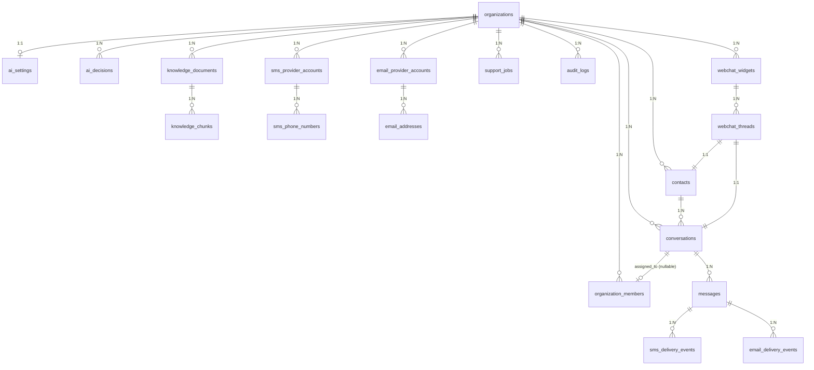

# Database Reference

> PostgreSQL schema reference. 19 tables, 6 migrations, 3 RPCs, RLS on all tenant-scoped tables.

## Migration files

Apply in order. All files are idempotent (`CREATE OR REPLACE`, `IF NOT EXISTS`).

| File | Contents |
|---|---|
| `insforge/migrations/001_initial_schema.sql` | 17 tables, indexes, constraints, extensions (`pgcrypto`, `vector`) |
| `insforge/migrations/002_rpc_functions.sql` | `match_knowledge_chunks`, `claim_support_jobs` |
| `insforge/migrations/003_rls_policies.sql` | RLS policies, `user_org_ids()` helper, credential column revocations |
| `insforge/migrations/004_create_organization_onboarding_rpc.sql` | `create_organization_with_owner(name, slug)` — atomic signup RPC |
| `insforge/migrations/005_webchat.sql` | Loosens `channel` CHECK to include `'webchat'`; adds `webchat_widgets`, `webchat_threads`; RLS for both |
| `insforge/migrations/006_backfill_conversation_activity.sql` | Backfills and indexes conversation activity timestamps |

Apply via the InsForge SQL editor or migrations API.

---

## Entity-relationship overview



Notes:
- `messages` has no direct `organization_id` — the org is reached via `conversations.organization_id`.
- `sms_delivery_events` and `email_delivery_events` also have no direct `organization_id` — reached via `messages → conversations`.
- `ai_settings` has a 1:1 with `organizations` (UNIQUE on `organization_id`).
- `webchat_threads.conversation_id` is `UNIQUE` (one thread per conversation).
- `webchat_widgets.hmac_secret` is server-side only — never returned to clients (see RLS section).

---

## Tables

### Organization

#### organizations

| Column | Type | Constraints | Description |
|---|---|---|---|
| `id` | `uuid` | PK, default `gen_random_uuid()` | Organization ID |
| `name` | `text` | NOT NULL | Display name |
| `slug` | `text` | NOT NULL, UNIQUE | URL-safe identifier |
| `metadata` | `jsonb` | NOT NULL, default `'{}'` | Extensible metadata |
| `created_at` | `timestamptz` | NOT NULL, default `now()` | |
| `updated_at` | `timestamptz` | NOT NULL, default `now()` | |

#### organization_members

| Column | Type | Constraints | Description |
|---|---|---|---|
| `id` | `uuid` | PK | |
| `organization_id` | `uuid` | NOT NULL, FK → `organizations` (CASCADE) | |
| `user_id` | `text` | NOT NULL | InsForge auth user ID |
| `role` | `text` | NOT NULL, CHECK `('owner','admin','agent','viewer')` | RBAC role |
| `created_at` | `timestamptz` | NOT NULL, default `now()` | |
| `updated_at` | `timestamptz` | NOT NULL, default `now()` | |

**Unique:** `(organization_id, user_id)`.

### Conversations

#### contacts

| Column | Type | Constraints | Description |
|---|---|---|---|
| `id` | `uuid` | PK | |
| `organization_id` | `uuid` | NOT NULL, FK → `organizations` (CASCADE) | |
| `name` | `text` | nullable | |
| `email` | `text` | nullable | |
| `phone` | `text` | nullable | E.164 |
| `metadata` | `jsonb` | NOT NULL, default `'{}'` | |
| `created_at` | `timestamptz` | NOT NULL | |
| `updated_at` | `timestamptz` | NOT NULL | |

**Indexes:** `idx_contacts_organization_id`, `idx_contacts_org_phone` (partial, `WHERE phone IS NOT NULL`), `idx_contacts_org_email` (partial, `WHERE email IS NOT NULL`).

#### conversations

| Column | Type | Constraints | Description |
|---|---|---|---|
| `id` | `uuid` | PK | |
| `organization_id` | `uuid` | NOT NULL, FK → `organizations` (CASCADE) | |
| `contact_id` | `uuid` | NOT NULL, FK → `contacts` (CASCADE) | |
| `channel` | `text` | NOT NULL, CHECK `('sms','email','webchat')` (loosened in 005) | |
| `status` | `text` | NOT NULL, default `'open'`, CHECK `('open','resolved','escalated')` (updated in 010) | |
| `ai_state` | `text` | NOT NULL, default `'idle'`, CHECK `('idle','thinking','drafted','auto_replied','needs_human','failed')` | |
| `subject` | `text` | nullable | Email subject line |
| `assigned_to` | `uuid` | nullable, FK → `organization_members` | |
| `last_message_at` | `timestamptz` | nullable | |
| `metadata` | `jsonb` | NOT NULL, default `'{}'` | |
| `created_at` | `timestamptz` | NOT NULL | |
| `updated_at` | `timestamptz` | NOT NULL | |

**Indexes:** `idx_conversations_org_status`, `idx_conversations_contact_id`, `idx_conversations_org_last_message` (DESC on `last_message_at`).

**Status state machine** (see [`architecture.md`](architecture.md#conversation-status-state-machine)):

```text
open → resolved | escalated
escalated → open | resolved
resolved → open (reopen)
```

#### messages

| Column | Type | Constraints | Description |
|---|---|---|---|
| `id` | `uuid` | PK | |
| `conversation_id` | `uuid` | NOT NULL, FK → `conversations` (CASCADE) | |
| `sender_type` | `text` | NOT NULL, CHECK `('contact','user','ai','system')` | |
| `sender_id` | `text` | nullable | User ID or contact ID |
| `direction` | `text` | NOT NULL, CHECK `('inbound','outbound')` | |
| `channel` | `text` | NOT NULL, CHECK `('sms','email','webchat')` (loosened in 005) | |
| `body` | `text` | NOT NULL | |
| `subject` | `text` | nullable | Email subject |
| `raw_payload` | `jsonb` | NOT NULL, default `'{}'` | Original webhook payload |
| `provider` | `text` | nullable | `twilio`, `postmark`, `webchat`, … |
| `provider_account_id` | `uuid` | nullable | FK by convention (not enforced) |
| `external_message_id` | `text` | nullable | Provider's message ID |
| `delivery_status` | `text` | default `'pending'`, CHECK `('pending','queued','sent','delivered','failed','bounced')` | |
| `created_at` | `timestamptz` | NOT NULL | |
| `updated_at` | `timestamptz` | NOT NULL | |

**Indexes:** `idx_messages_provider_external_id` — **partial unique** on `(provider, external_message_id)` `WHERE provider IS NOT NULL AND external_message_id IS NOT NULL`. Enforces message deduplication per provider.

### SMS

#### sms_provider_accounts

| Column | Type | Constraints | Description |
|---|---|---|---|
| `id` | `uuid` | PK | |
| `organization_id` | `uuid` | NOT NULL, FK → `organizations` (CASCADE) | |
| `provider` | `text` | NOT NULL | `twilio`, `telnyx`, … |
| `label` | `text` | NOT NULL | |
| `credentials_secret_id` | `text` | NOT NULL | Reference to stored secrets — **column-level SELECT revoked** |
| `is_active` | `boolean` | NOT NULL, default `true` | |
| `metadata` | `jsonb` | NOT NULL, default `'{}'` | |
| `created_at` | `timestamptz` | NOT NULL | |
| `updated_at` | `timestamptz` | NOT NULL | |

#### sms_phone_numbers

| Column | Type | Constraints | Description |
|---|---|---|---|
| `id` | `uuid` | PK | |
| `provider_account_id` | `uuid` | NOT NULL, FK → `sms_provider_accounts` (CASCADE) | |
| `organization_id` | `uuid` | NOT NULL, FK → `organizations` (CASCADE) | Denormalized for direct lookup |
| `phone_number` | `text` | NOT NULL | E.164 |
| `is_default` | `boolean` | NOT NULL, default `false` | |
| `created_at` | `timestamptz` | NOT NULL | |

#### sms_delivery_events

| Column | Type | Constraints | Description |
|---|---|---|---|
| `id` | `uuid` | PK | |
| `message_id` | `uuid` | NOT NULL, FK → `messages` (CASCADE) | |
| `provider_account_id` | `uuid` | nullable, FK → `sms_provider_accounts` | |
| `status` | `text` | NOT NULL | Provider's status string |
| `error_code` | `text` | nullable | |
| `error_message` | `text` | nullable | |
| `raw_payload` | `jsonb` | NOT NULL, default `'{}'` | |
| `created_at` | `timestamptz` | NOT NULL | |

### Email

#### email_provider_accounts

Identical structure to `sms_provider_accounts`, with the same `credentials_secret_id` column-level revocation.

#### email_addresses

Identical structure to `sms_phone_numbers`, but with `email_address` instead of `phone_number`.

#### email_delivery_events

Identical structure to `sms_delivery_events`.

### AI

#### ai_settings

| Column | Type | Constraints | Description |
|---|---|---|---|
| `id` | `uuid` | PK | |
| `organization_id` | `uuid` | NOT NULL, UNIQUE, FK → `organizations` (CASCADE) | 1:1 with org |
| `ai_mode` | `text` | NOT NULL, default `'draft_only'`, CHECK `('off','draft_only','auto_reply')` | |
| `confidence_threshold` | `numeric(3,2)` | NOT NULL, default `0.75` | Min confidence for `auto_reply` to send |
| `context_window_size` | `integer` | NOT NULL, default `20` | Max messages to send to LLM |
| `max_consecutive_failures` | `integer` | NOT NULL, default `3` | Triggers `RepeatedFailureRule` |
| `knowledge_similarity_threshold` | `numeric(3,2)` | NOT NULL, default `0.70` | Min cosine similarity to consider a chunk |
| `escalation_keywords` | `text[]` | NOT NULL, default `'{}'` | Custom `KeywordRule` triggers |
| `system_prompt` | `text` | nullable | Custom LLM system prompt |
| `model` | `text` | NOT NULL, default `'openai/gpt-4o-mini'` | LLM model identifier |
| `created_at` | `timestamptz` | NOT NULL | |
| `updated_at` | `timestamptz` | NOT NULL | |

#### ai_decisions

| Column | Type | Constraints | Description |
|---|---|---|---|
| `id` | `uuid` | PK | |
| `conversation_id` | `uuid` | NOT NULL, FK → `conversations` (CASCADE) | |
| `organization_id` | `uuid` | NOT NULL, FK → `organizations` (CASCADE) | |
| `message_id` | `uuid` | nullable, FK → `messages` | The triggering inbound message |
| `decision_type` | `text` | NOT NULL, CHECK `('respond','escalate','clarify')` | |
| `confidence` | `numeric(3,2)` | NOT NULL | 0.00 – 1.00 |
| `reasoning_summary` | `text` | nullable | LLM's reasoning |
| `response_text` | `text` | nullable | Drafted response |
| `tags` | `text[]` | NOT NULL, default `'{}'` | |
| `requires_human` | `boolean` | NOT NULL, default `false` | |
| `raw_response` | `jsonb` | nullable | Full LLM response for debugging |
| `created_at` | `timestamptz` | NOT NULL | |

### Knowledge

#### knowledge_documents

| Column | Type | Constraints | Description |
|---|---|---|---|
| `id` | `uuid` | PK | |
| `organization_id` | `uuid` | NOT NULL, FK → `organizations` (CASCADE) | |
| `title` | `text` | NOT NULL | |
| `source_type` | `text` | NOT NULL | `manual`, `upload`, … |
| `body` | `text` | NOT NULL | Full document text |
| `status` | `text` | NOT NULL, default `'pending'`, CHECK `('pending','processing','ready','failed')` | |
| `error_message` | `text` | nullable | |
| `created_at` | `timestamptz` | NOT NULL | |
| `updated_at` | `timestamptz` | NOT NULL | |

#### knowledge_chunks

| Column | Type | Constraints | Description |
|---|---|---|---|
| `id` | `uuid` | PK | |
| `document_id` | `uuid` | NOT NULL, FK → `knowledge_documents` (CASCADE) | |
| `organization_id` | `uuid` | NOT NULL, FK → `organizations` (CASCADE) | |
| `content` | `text` | NOT NULL | |
| `embedding` | `vector(1536)` | NOT NULL | OpenAI-compatible |
| `metadata` | `jsonb` | NOT NULL, default `'{}'` | |
| `created_at` | `timestamptz` | NOT NULL | |

**Indexes:** `idx_knowledge_chunks_embedding` — **HNSW** with `vector_cosine_ops` for fast approximate nearest neighbor search.

### Infrastructure

#### support_jobs

| Column | Type | Constraints | Description |
|---|---|---|---|
| `id` | `uuid` | PK | |
| `organization_id` | `uuid` | NOT NULL, FK → `organizations` (CASCADE) | |
| `job_type` | `text` | NOT NULL | See [`jobs.md`](jobs.md) |
| `payload` | `jsonb` | NOT NULL, default `'{}'` | |
| `status` | `text` | NOT NULL, default `'pending'`, CHECK `('pending','claimed','completed','failed','dead')` | |
| `attempts` | `integer` | NOT NULL, default `0` | |
| `max_attempts` | `integer` | NOT NULL, default `5` | |
| `last_error` | `text` | nullable | |
| `run_after` | `timestamptz` | NOT NULL, default `now()` | |
| `created_at` | `timestamptz` | NOT NULL | |
| `updated_at` | `timestamptz` | NOT NULL | |
| `completed_at` | `timestamptz` | nullable | |

**Indexes:** `idx_support_jobs_pending` — partial on `(status, run_after)` `WHERE status = 'pending'`.

#### audit_logs

| Column | Type | Constraints | Description |
|---|---|---|---|
| `id` | `uuid` | PK | |
| `organization_id` | `uuid` | NOT NULL, FK → `organizations` (CASCADE) | |
| `actor_id` | `text` | nullable | User ID or system identifier |
| `actor_type` | `text` | NOT NULL, CHECK `('user','system','ai')` | |
| `action` | `text` | NOT NULL | See [`audit.md`](audit.md) |
| `resource_type` | `text` | NOT NULL | `conversation`, `ai_decision`, … |
| `resource_id` | `text` | nullable | |
| `metadata` | `jsonb` | NOT NULL, default `'{}'` | |
| `created_at` | `timestamptz` | NOT NULL | |

**Indexes:** `idx_audit_logs_org_created` (composite `(organization_id, created_at DESC)`).

### Web chat (added in migration 005)

#### webchat_widgets

| Column | Type | Constraints | Description |
|---|---|---|---|
| `id` | `uuid` | PK | |
| `organization_id` | `uuid` | NOT NULL, FK → `organizations` (CASCADE) | |
| `name` | `text` | NOT NULL | Internal name (e.g. "Marketing site widget") |
| `widget_token` | `text` | NOT NULL, UNIQUE | Public token sent by browser as `x-widget-token` |
| `hmac_secret` | `text` | NOT NULL | Server-side only — used to sign visitor JWTs (HS256) |
| `allowed_domains` | `text[]` | NOT NULL, default `'{}'` | Empty = allow all; supports `*.example.com` wildcards |
| `position` | `text` | NOT NULL, default `'bottom-right'`, CHECK `('bottom-right','bottom-left')` | |
| `primary_color` | `text` | default `'#2563eb'` | |
| `greeting` | `text` | nullable | First system message on thread init |
| `pre_chat_enabled` | `boolean` | NOT NULL, default `false` | Show pre-chat name/email form |
| `ai_mode_override` | `text` | nullable, CHECK `('off','draft_only','auto_reply')` | Per-widget override of org-level AI mode |
| `is_active` | `boolean` | NOT NULL, default `true` | |
| `created_at` | `timestamptz` | NOT NULL | |
| `updated_at` | `timestamptz` | NOT NULL | |

**Indexes:** `idx_webchat_widgets_org`.

> **Security note:** `hmac_secret` is intended to remain server-side. The current RLS policies do not revoke SELECT on this column at the SQL level (unlike `credentials_secret_id`); callers should restrict access at the application layer.

#### webchat_threads

| Column | Type | Constraints | Description |
|---|---|---|---|
| `id` | `uuid` | PK | |
| `organization_id` | `uuid` | NOT NULL, FK → `organizations` (CASCADE) | |
| `widget_id` | `uuid` | NOT NULL, FK → `webchat_widgets` (CASCADE) | |
| `conversation_id` | `uuid` | NOT NULL, UNIQUE, FK → `conversations` (CASCADE) | 1:1 with conversation |
| `contact_id` | `uuid` | NOT NULL, FK → `contacts` (CASCADE) | |
| `visitor_token_jti` | `text` | NOT NULL, UNIQUE | Visitor JWT JTI — rotated on identify |
| `first_seen_at` | `timestamptz` | NOT NULL, default `now()` | |
| `last_seen_at` | `timestamptz` | NOT NULL, default `now()` | Updated on every inbound message |
| `identified_at` | `timestamptz` | nullable | Set when visitor provides email |
| `page_url` | `text` | nullable | |
| `referrer` | `text` | nullable | |
| `user_agent` | `text` | nullable | |
| `ip_country` | `text` | nullable | |
| `ip_city` | `text` | nullable | |
| `metadata` | `jsonb` | NOT NULL, default `'{}'` | |
| `created_at` | `timestamptz` | NOT NULL | |
| `updated_at` | `timestamptz` | NOT NULL | |

**Indexes:** `idx_webchat_threads_widget_visitor` on `(widget_id, last_seen_at DESC)`, `idx_webchat_threads_conversation` on `(conversation_id)`.

---

## RPC functions

### `match_knowledge_chunks(query_embedding vector(1536), match_org_id uuid, match_limit int DEFAULT 5, match_threshold float DEFAULT 0.7)`

Vector similarity search for RAG. Returns `id`, `document_id`, `content`, `metadata`, `similarity` for the top matching chunks. Filters by `organization_id` and `1 - (embedding <=> query_embedding) > match_threshold`. Order is by similarity descending.

Called by `KnowledgeRepository.matchChunks()`.

### `claim_support_jobs(claim_limit int DEFAULT 5)`

Atomically claims up to N pending jobs whose `run_after <= now()`, setting their status to `claimed`. Uses `SELECT FOR UPDATE SKIP LOCKED` to prevent contention between concurrent workers.

> **Note:** The current `PostgresJobQueue.claim(limit)` calls this RPC with `{ max_count: limit }` (the parameter name in the RPC is `claim_limit` but the queue calls it `max_count` — they may need to be aligned; see [`jobs.md`](jobs.md#known-quirks)).

### `create_organization_with_owner(org_name text, org_slug text DEFAULT NULL)`

Atomic onboarding RPC. Idempotent for repeat calls: if the actor is already a member of any organization, it ensures the first org has an `ai_settings` row and returns it. Otherwise it creates the organization with a unique slug (loop with `suffix`), creates the owner member record, creates the `ai_settings` row, and writes an `audit_logs` entry (`action: 'organization_created'`). Defined with `SECURITY DEFINER`.

Throws:
- `'Authentication required'` (SQLSTATE `28000`) if no JWT.
- `'Organization name is required'` (SQLSTATE `22023`) if the trimmed name is empty.

Called by `lib/onboarding.ts` after signup.

---

## RLS policies

All 19 tables have RLS enabled. The general pattern:

| Operation | Policy |
|---|---|
| `SELECT` | `organization_id IN (SELECT user_org_ids())` |
| `INSERT` | `WITH CHECK (organization_id IN (SELECT user_org_ids()))` |
| `UPDATE` | `USING (organization_id IN (SELECT user_org_ids()))` |
| `DELETE` | `USING (organization_id IN (SELECT user_org_ids()))` |

`user_org_ids()` is a `SECURITY DEFINER` SQL function in `insforge/migrations/003_rls_policies.sql`:

```sql
CREATE OR REPLACE FUNCTION public.user_org_ids()
RETURNS SETOF uuid
LANGUAGE sql STABLE SECURITY DEFINER
AS $$
  SELECT om.organization_id
  FROM organization_members om
  WHERE om.user_id = auth.uid()::text;
$$;
```

### Exceptions

- **`organizations` INSERT** — `WITH CHECK (true)`. Any authenticated user can create an org. Membership is assigned in the same transaction by the application layer (or by the `create_organization_with_owner` RPC).
- **`audit_logs`** — Append-only. Only `SELECT` and `INSERT` policies exist. No `UPDATE` or `DELETE` policies, so RLS denies those by default.
- **`messages`, `sms_delivery_events`, `email_delivery_events`** — no direct `organization_id`; access is determined by joining through `messages → conversations` to reach the org.
- **`webchat_widgets`, `webchat_threads`** (in 005) — the RLS policies use a slightly different pattern: they read the user ID from `current_setting('request.jwt.claims', true)::json->>'sub'` directly, rather than calling `user_org_ids()`. They are functionally equivalent but use the raw JWT claim instead of the helper. This is a minor inconsistency worth noting if you change JWT handling.

### Column-level credential protection

`credentials_secret_id` on both `sms_provider_accounts` and `email_provider_accounts` has column-level `SELECT` revoked from `anon` and `authenticated` roles. PostgREST will never return this column to clients.

```sql
REVOKE SELECT (credentials_secret_id) ON sms_provider_accounts FROM anon;
REVOKE SELECT (credentials_secret_id) ON sms_provider_accounts FROM authenticated;
REVOKE SELECT (credentials_secret_id) ON email_provider_accounts FROM anon;
REVOKE SELECT (credentials_secret_id) ON email_provider_accounts FROM authenticated;
```

---

## Indexes (full list)

| Table | Index | Type | Purpose |
|---|---|---|---|
| `contacts` | `idx_contacts_organization_id` | btree | Lookup by org |
| `contacts` | `idx_contacts_org_phone` | btree partial `(organization_id, phone) WHERE phone IS NOT NULL` | Phone-based contact lookup |
| `contacts` | `idx_contacts_org_email` | btree partial `(organization_id, email) WHERE email IS NOT NULL` | Email-based contact lookup |
| `conversations` | `idx_conversations_org_status` | btree | Filter by org + status |
| `conversations` | `idx_conversations_contact_id` | btree | Lookup by contact |
| `conversations` | `idx_conversations_org_last_message` | btree `(organization_id, last_message_at DESC)` | Inbox sort by recent activity |
| `messages` | `idx_messages_provider_external_id` | **unique partial** `(provider, external_message_id) WHERE provider IS NOT NULL AND external_message_id IS NOT NULL` | Dedup |
| `knowledge_documents` | `idx_knowledge_documents_org_id` | btree | Org lookup |
| `knowledge_chunks` | `idx_knowledge_chunks_embedding` | **HNSW** `(embedding vector_cosine_ops)` | Vector similarity |
| `support_jobs` | `idx_support_jobs_pending` | **partial** `(status, run_after) WHERE status = 'pending'` | Queue claim |
| `audit_logs` | `idx_audit_logs_org_created` | btree `(organization_id, created_at DESC)` | Chronological audit query |
| `webchat_widgets` | `idx_webchat_widgets_org` | btree | Org lookup |
| `webchat_threads` | `idx_webchat_threads_widget_visitor` | btree `(widget_id, last_seen_at DESC)` | Active thread list |
| `webchat_threads` | `idx_webchat_threads_conversation` | btree `(conversation_id)` | Reverse lookup |
