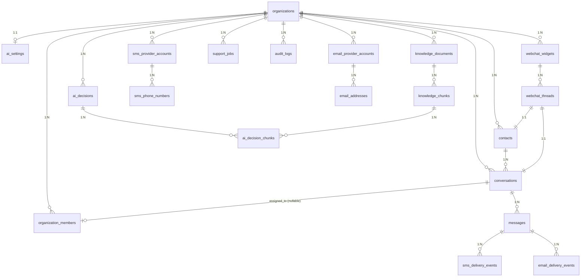

# Database Reference

> PostgreSQL schema reference. 20 application tables, 18 migration files, 8 application-callable RPCs, and role-aware RLS on tenant-scoped data.

## Migration files

Apply pending files in the order shown. Do not replay the whole set against an initialized schema; not every historical migration is idempotent.

| File | Purpose |
|---|---|
| `insforge/migrations/001_initial_schema.sql` | 17 core tables, indexes, CHECK constraints, `pgcrypto` + `vector` extensions |
| `insforge/migrations/002_rpc_functions.sql` | `match_knowledge_chunks` (RAG); initial `claim_support_jobs` (superseded by 008) |
| `insforge/migrations/003_rls_policies.sql` | RLS policies, `user_org_ids()` helper, `credentials_secret_id` column revocations |
| `insforge/migrations/004_create_organization_onboarding_rpc.sql` | `create_organization_with_owner(name, slug)` — atomic signup RPC |
| `insforge/migrations/005_webchat.sql` | Loosens `channel` CHECK for `'webchat'`; `webchat_widgets`, `webchat_threads` tables + RLS |
| `insforge/migrations/006_backfill_conversation_activity.sql` | Backfills `last_message_at` / `last_customer_message_at` on conversations |
| `insforge/migrations/007_ai_decision_chunks.sql` | `ai_decision_chunks` table; `ai_decision_chunks_validate()` trigger; `insert_ai_decision_chunks()` RPC |
| `insforge/migrations/008_claim_failed_jobs.sql` | Drops old `idx_support_jobs_pending`; new `idx_support_jobs_claimable` index; replaces `claim_support_jobs` with overload using `claim_limit` that also claims failed jobs |
| `insforge/migrations/009_org_sla_thresholds.sql` | Adds `organizations.sla_thresholds jsonb`; `conversations.last_message_direction text`; backfill from `messages.direction` |
| `insforge/migrations/010_drop_pending_status.sql` | Drops `'pending'` from `conversations.status` CHECK (was in 001 but never assigned by code) |
| `insforge/migrations/011_ai_settings_embedding_model.sql` | Adds `ai_settings.embedding_model`; changes the chat-model default |
| `insforge/migrations/012_replace_knowledge_chunks.sql` | Adds the transactional `replace_knowledge_chunks` RPC |
| `insforge/migrations/013_webchat_realtime_widget_channel.sql` | Registers org/widget realtime channels and adds the server-only `publish_realtime_message` RPC |
| `insforge/migrations/20260615074718_trigger-process-jobs-on-insert.sql` | Adds an HTTP job trigger (superseded by the next migration after the extension proved unreliable) |
| `insforge/migrations/20260615080500_drop-broken-trigger.sql` | Drops the unreliable HTTP job trigger; scheduled processing remains the active path |
| `insforge/migrations/014_role_aware_rls_and_knowledge_storage.sql` | Adds role-aware settings/knowledge/job policies, secret-safe client grants, file keys, and organization-scoped storage policies |
| `insforge/migrations/015_bind_knowledge_jobs_to_documents.sql` | Binds browser-enqueued knowledge jobs to documents owned by the same organization |
| `insforge/migrations/016_job_and_ai_decision_idempotency.sql` | Adds retry-safe job/decision, stale-claim, knowledge-revision, and inbound-audit guards |

Apply via the InsForge SQL editor or migrations API. Migration `014` cannot change bucket configuration: after applying it, mark the existing `knowledge-files` bucket **private** in the InsForge dashboard. Then apply `015` for knowledge-job tenant binding and `016` for job/decision idempotency, claim leases, revision-safe knowledge re-indexing, and atomic inbound-audit repair. Storage object keys must use `<organization-id>/documents/...` so its policies can derive the tenant from the first path segment.

---

## Entity-relationship overview



Notes:
- `messages` has no direct `organization_id` — the org is reached via `conversations.organization_id`.
- `sms_delivery_events` and `email_delivery_events` also have no direct `organization_id` — reached via `messages → conversations`.
- `ai_settings` has a 1:1 with `organizations` (UNIQUE on `organization_id`).
- `webchat_threads.conversation_id` is `UNIQUE` (one thread per conversation).
- `webchat_widgets.hmac_secret` is server-side only — never returned to clients (see RLS section).

---

## Tables

### Organization

#### organizations

| Column | Type | Constraints | Description |
|---|---|---|---|
| `id` | `uuid` | PK, default `gen_random_uuid()` | Organization ID |
| `name` | `text` | NOT NULL | Display name |
| `slug` | `text` | NOT NULL, UNIQUE | URL-safe identifier |
| `metadata` | `jsonb` | NOT NULL, default `'{}'` | Extensible metadata |
| `created_at` | `timestamptz` | NOT NULL, default `now()` | |
| `updated_at` | `timestamptz` | NOT NULL, default `now()` | |

#### organization_members

| Column | Type | Constraints | Description |
|---|---|---|---|
| `id` | `uuid` | PK | |
| `organization_id` | `uuid` | NOT NULL, FK → `organizations` (CASCADE) | |
| `user_id` | `text` | NOT NULL | InsForge auth user ID |
| `role` | `text` | NOT NULL, CHECK `('owner','admin','agent','viewer')` | RBAC role |
| `created_at` | `timestamptz` | NOT NULL, default `now()` | |
| `updated_at` | `timestamptz` | NOT NULL, default `now()` | |

**Unique:** `(organization_id, user_id)`.

### Conversations

#### contacts

| Column | Type | Constraints | Description |
|---|---|---|---|
| `id` | `uuid` | PK | |
| `organization_id` | `uuid` | NOT NULL, FK → `organizations` (CASCADE) | |
| `name` | `text` | nullable | |
| `email` | `text` | nullable | |
| `phone` | `text` | nullable | E.164 |
| `metadata` | `jsonb` | NOT NULL, default `'{}'` | |
| `created_at` | `timestamptz` | NOT NULL | |
| `updated_at` | `timestamptz` | NOT NULL | |

**Indexes:** `idx_contacts_organization_id`, `idx_contacts_org_phone` (partial, `WHERE phone IS NOT NULL`), `idx_contacts_org_email` (partial, `WHERE email IS NOT NULL`).

#### conversations

| Column | Type | Constraints | Description |
|---|---|---|---|
| `id` | `uuid` | PK | |
| `organization_id` | `uuid` | NOT NULL, FK → `organizations` (CASCADE) | |
| `contact_id` | `uuid` | NOT NULL, FK → `contacts` (CASCADE) | |
| `channel` | `text` | NOT NULL, CHECK `('sms','email','webchat')` (loosened in 005) | |
| `status` | `text` | NOT NULL, default `'open'`, CHECK `('open','resolved','escalated')` (updated in 010) | |
| `ai_state` | `text` | NOT NULL, default `'idle'`, CHECK `('idle','thinking','drafted','auto_replied','needs_human','failed')` | |
| `subject` | `text` | nullable | Email subject line |
| `assigned_to` | `uuid` | nullable, FK → `organization_members` | |
| `last_message_at` | `timestamptz` | nullable | |
| `metadata` | `jsonb` | NOT NULL, default `'{}'` | |
| `created_at` | `timestamptz` | NOT NULL | |
| `updated_at` | `timestamptz` | NOT NULL | |

**Indexes:** `idx_conversations_org_status`, `idx_conversations_contact_id`, `idx_conversations_org_last_message` (DESC on `last_message_at`).

**Status state machine** (see [`architecture.md`](architecture.md#conversation-status-state-machine)):

```text
open → resolved | escalated
escalated → open | resolved
resolved → open (reopen)
```

#### messages

| Column | Type | Constraints | Description |
|---|---|---|---|
| `id` | `uuid` | PK | |
| `conversation_id` | `uuid` | NOT NULL, FK → `conversations` (CASCADE) | |
| `sender_type` | `text` | NOT NULL, CHECK `('contact','user','ai','system')` | |
| `sender_id` | `text` | nullable | User ID or contact ID |
| `direction` | `text` | NOT NULL, CHECK `('inbound','outbound')` | |
| `channel` | `text` | NOT NULL, CHECK `('sms','email','webchat')` (loosened in 005) | |
| `body` | `text` | NOT NULL | |
| `subject` | `text` | nullable | Email subject |
| `raw_payload` | `jsonb` | NOT NULL, default `'{}'` | Original webhook payload |
| `provider` | `text` | nullable | `twilio`, `postmark`, `webchat`, … |
| `provider_account_id` | `uuid` | nullable | FK by convention (not enforced) |
| `external_message_id` | `text` | nullable | Provider's message ID |
| `delivery_status` | `text` | default `'pending'`, CHECK `('pending','queued','sent','delivered','failed','bounced')` | |
| `created_at` | `timestamptz` | NOT NULL | |
| `updated_at` | `timestamptz` | NOT NULL | |

**Indexes:** `idx_messages_provider_external_id` — **partial unique** on `(provider, external_message_id)` `WHERE provider IS NOT NULL AND external_message_id IS NOT NULL`. Enforces message deduplication per provider.

### SMS

#### sms_provider_accounts

| Column | Type | Constraints | Description |
|---|---|---|---|
| `id` | `uuid` | PK | |
| `organization_id` | `uuid` | NOT NULL, FK → `organizations` (CASCADE) | |
| `provider` | `text` | NOT NULL | `twilio`, `telnyx`, … |
| `label` | `text` | NOT NULL | |
| `credentials_secret_id` | `text` | NOT NULL | Server-only secret reference — excluded from authenticated client SELECT grants by migration 014 |
| `is_active` | `boolean` | NOT NULL, default `true` | |
| `metadata` | `jsonb` | NOT NULL, default `'{}'` | |
| `created_at` | `timestamptz` | NOT NULL | |
| `updated_at` | `timestamptz` | NOT NULL | |

#### sms_phone_numbers

| Column | Type | Constraints | Description |
|---|---|---|---|
| `id` | `uuid` | PK | |
| `provider_account_id` | `uuid` | NOT NULL, FK → `sms_provider_accounts` (CASCADE) | |
| `organization_id` | `uuid` | NOT NULL, FK → `organizations` (CASCADE) | Denormalized for direct lookup |
| `phone_number` | `text` | NOT NULL | E.164 |
| `is_default` | `boolean` | NOT NULL, default `false` | |
| `created_at` | `timestamptz` | NOT NULL | |

#### sms_delivery_events

| Column | Type | Constraints | Description |
|---|---|---|---|
| `id` | `uuid` | PK | |
| `message_id` | `uuid` | NOT NULL, FK → `messages` (CASCADE) | |
| `provider_account_id` | `uuid` | nullable, FK → `sms_provider_accounts` | |
| `status` | `text` | NOT NULL | Provider's status string |
| `error_code` | `text` | nullable | |
| `error_message` | `text` | nullable | |
| `raw_payload` | `jsonb` | NOT NULL, default `'{}'` | |
| `created_at` | `timestamptz` | NOT NULL | |

### Email

#### email_provider_accounts

Identical structure to `sms_provider_accounts`; `credentials_secret_id` is excluded from authenticated client SELECT grants.

#### email_addresses

Identical structure to `sms_phone_numbers`, but with `email_address` instead of `phone_number`.

#### email_delivery_events

Identical structure to `sms_delivery_events`.

### AI

#### ai_settings

| Column | Type | Constraints | Description |
|---|---|---|---|
| `id` | `uuid` | PK | |
| `organization_id` | `uuid` | NOT NULL, UNIQUE, FK → `organizations` (CASCADE) | 1:1 with org |
| `ai_mode` | `text` | NOT NULL, default `'draft_only'`, CHECK `('off','draft_only','auto_reply')` | |
| `confidence_threshold` | `numeric(3,2)` | NOT NULL, default `0.75` | Min confidence for `auto_reply` to send |
| `context_window_size` | `integer` | NOT NULL, default `20` | Max messages to send to LLM |
| `max_consecutive_failures` | `integer` | NOT NULL, default `3` | Triggers `RepeatedFailureRule` |
| `knowledge_similarity_threshold` | `numeric(3,2)` | NOT NULL, default `0.70` | Min cosine similarity to consider a chunk |
| `escalation_keywords` | `text[]` | NOT NULL, default `'{}'` | Custom `KeywordRule` triggers |
| `system_prompt` | `text` | nullable | Custom LLM system prompt |
| `model` | `text` | NOT NULL, default `'openai/gpt-5-mini'` (since 011) | Chat model identifier |
| `embedding_model` | `text` | NOT NULL, default `'openai/text-embedding-3-small'` (since 011) | Knowledge embedding model; changing it requires re-indexing |
| `created_at` | `timestamptz` | NOT NULL | |
| `updated_at` | `timestamptz` | NOT NULL | |

#### ai_decisions

| Column | Type | Constraints | Description |
|---|---|---|---|
| `id` | `uuid` | PK | |
| `conversation_id` | `uuid` | NOT NULL, FK → `conversations` (CASCADE) | |
| `organization_id` | `uuid` | NOT NULL, FK → `organizations` (CASCADE) | |
| `source_job_id` | `uuid` | nullable, FK → `support_jobs` (SET NULL), unique when present | Queue job that produced the decision (since 016) |
| `message_id` | `uuid` | nullable, FK → `messages` | The triggering inbound message |
| `decision_type` | `text` | NOT NULL, CHECK `('respond','escalate','clarify')` | |
| `confidence` | `numeric(3,2)` | NOT NULL | 0.00 – 1.00 |
| `reasoning_summary` | `text` | nullable | LLM's reasoning |
| `response_text` | `text` | nullable | Drafted response |
| `tags` | `text[]` | NOT NULL, default `'{}'` | |
| `requires_human` | `boolean` | NOT NULL, default `false` | |
| `raw_response` | `jsonb` | nullable | Full LLM response for debugging |
| `created_at` | `timestamptz` | NOT NULL | |

#### ai_decision_chunks (added in migration 007)

| Column | Type | Constraints | Description |
|---|---|---|---|
| `id` | `uuid` | PK | |
| `ai_decision_id` | `uuid` | NOT NULL, FK → `ai_decisions` (CASCADE) | |
| `knowledge_chunk_id` | `uuid` | NOT NULL, FK → `knowledge_chunks` (CASCADE) | |
| `organization_id` | `uuid` | NOT NULL, FK → `organizations` (CASCADE) | Denormalized for RLS |
| `rank` | `integer` | NOT NULL | Ordering within an AI decision |
| `similarity` | `numeric(4,3)` | nullable | Cosine similarity score |
| `created_at` | `timestamptz` | NOT NULL | |

**Indexes:** `idx_ai_decision_chunks_decision` (btree on `ai_decision_id`), `idx_ai_decision_chunks_org` (btree on `organization_id`), UNIQUE `(ai_decision_id, knowledge_chunk_id)`.

### Knowledge

#### knowledge_documents

| Column | Type | Constraints | Description |
|---|---|---|---|
| `id` | `uuid` | PK | |
| `organization_id` | `uuid` | NOT NULL, FK → `organizations` (CASCADE) | |
| `title` | `text` | NOT NULL | |
| `source_type` | `text` | NOT NULL | `manual`, `upload`, … |
| `body` | `text` | NOT NULL | Full document text |
| `content_revision` | `uuid` | NOT NULL, default `gen_random_uuid()` | Immutable version token for queued re-index work (since 016) |
| `file_url` | `text` | nullable | Legacy/source URL for uploaded content |
| `file_name` | `text` | nullable | Original upload filename |
| `file_key` | `text` | nullable | Object key in the private `knowledge-files` bucket; new uploads use `<organization-id>/documents/...` |
| `status` | `text` | NOT NULL, default `'pending'`, CHECK `('pending','processing','ready','failed')` | |
| `error_message` | `text` | nullable | |
| `created_at` | `timestamptz` | NOT NULL | |
| `updated_at` | `timestamptz` | NOT NULL | |

#### knowledge_chunks

| Column | Type | Constraints | Description |
|---|---|---|---|
| `id` | `uuid` | PK | |
| `document_id` | `uuid` | NOT NULL, FK → `knowledge_documents` (CASCADE) | |
| `organization_id` | `uuid` | NOT NULL, FK → `organizations` (CASCADE) | |
| `content` | `text` | NOT NULL | |
| `embedding` | `vector(1536)` | NOT NULL | OpenAI-compatible |
| `metadata` | `jsonb` | NOT NULL, default `'{}'` | |
| `created_at` | `timestamptz` | NOT NULL | |

**Indexes:** `idx_knowledge_chunks_embedding` — **HNSW** with `vector_cosine_ops` for fast approximate nearest neighbor search.

### Infrastructure

#### support_jobs

| Column | Type | Constraints | Description |
|---|---|---|---|
| `id` | `uuid` | PK | |
| `organization_id` | `uuid` | NOT NULL, FK → `organizations` (CASCADE) | |
| `job_type` | `text` | NOT NULL | See [`jobs.md`](jobs.md) |
| `payload` | `jsonb` | NOT NULL, default `'{}'` | |
| `idempotency_key` | `text` | nullable; unique with org/type while active | Deterministic key for concurrent enqueue protection (since 016) |
| `status` | `text` | NOT NULL, default `'pending'`, CHECK `('pending','claimed','completed','failed','dead')` | |
| `attempts` | `integer` | NOT NULL, default `0` | |
| `max_attempts` | `integer` | NOT NULL, default `5` | |
| `last_error` | `text` | nullable | |
| `run_after` | `timestamptz` | NOT NULL, default `now()` | |
| `created_at` | `timestamptz` | NOT NULL | |
| `updated_at` | `timestamptz` | NOT NULL | |
| `completed_at` | `timestamptz` | nullable | |

**Indexes:** `idx_support_jobs_claimable` — partial on `(run_after, created_at)` where status is `pending` or `failed`; `idx_support_jobs_active_idempotency` — unique partial on `(organization_id, job_type, idempotency_key)` while status is pending, claimed, or failed; `idx_support_jobs_stale_claim` — partial on `updated_at` for claimed-job lease reconciliation.

#### audit_logs

| Column | Type | Constraints | Description |
|---|---|---|---|
| `id` | `uuid` | PK | |
| `organization_id` | `uuid` | NOT NULL, FK → `organizations` (CASCADE) | |
| `actor_id` | `text` | nullable | User ID or system identifier |
| `actor_type` | `text` | NOT NULL, CHECK `('user','system','ai')` | |
| `action` | `text` | NOT NULL | See [`audit.md`](audit.md) |
| `resource_type` | `text` | NOT NULL | `conversation`, `ai_decision`, … |
| `resource_id` | `text` | nullable | |
| `metadata` | `jsonb` | NOT NULL, default `'{}'` | |
| `created_at` | `timestamptz` | NOT NULL | |

**Indexes:** `idx_audit_logs_org_created` (composite `(organization_id, created_at DESC)`).

### Web chat (added in migration 005)

#### webchat_widgets

| Column | Type | Constraints | Description |
|---|---|---|---|
| `id` | `uuid` | PK | |
| `organization_id` | `uuid` | NOT NULL, FK → `organizations` (CASCADE) | |
| `name` | `text` | NOT NULL | Internal name (e.g. "Marketing site widget") |
| `widget_token` | `text` | NOT NULL, UNIQUE | Public token sent by browser as `x-widget-token` |
| `hmac_secret` | `text` | NOT NULL | Server-side only — used to sign visitor JWTs (HS256) |
| `allowed_domains` | `text[]` | NOT NULL, default `'{}'` | Empty = allow all; supports `*.example.com` wildcards |
| `position` | `text` | NOT NULL, default `'bottom-right'`, CHECK `('bottom-right','bottom-left')` | |
| `primary_color` | `text` | default `'#2563eb'` | |
| `greeting` | `text` | nullable | First system message on thread init |
| `pre_chat_enabled` | `boolean` | NOT NULL, default `false` | Show pre-chat name/email form |
| `ai_mode_override` | `text` | nullable, CHECK `('off','draft_only','auto_reply')` | Per-widget override of org-level AI mode |
| `is_active` | `boolean` | NOT NULL, default `true` | |
| `created_at` | `timestamptz` | NOT NULL | |
| `updated_at` | `timestamptz` | NOT NULL | |

**Indexes:** `idx_webchat_widgets_org`.

> **Security note:** Migration `014` replaces the broad client SELECT grant with a safe column list that excludes `hmac_secret`.

#### webchat_threads

| Column | Type | Constraints | Description |
|---|---|---|---|
| `id` | `uuid` | PK | |
| `organization_id` | `uuid` | NOT NULL, FK → `organizations` (CASCADE) | |
| `widget_id` | `uuid` | NOT NULL, FK → `webchat_widgets` (CASCADE) | |
| `conversation_id` | `uuid` | NOT NULL, UNIQUE, FK → `conversations` (CASCADE) | 1:1 with conversation |
| `contact_id` | `uuid` | NOT NULL, FK → `contacts` (CASCADE) | |
| `visitor_token_jti` | `text` | NOT NULL, UNIQUE | Visitor JWT JTI — rotated on identify |
| `first_seen_at` | `timestamptz` | NOT NULL, default `now()` | |
| `last_seen_at` | `timestamptz` | NOT NULL, default `now()` | Updated on every inbound message |
| `identified_at` | `timestamptz` | nullable | Set when visitor provides email |
| `page_url` | `text` | nullable | |
| `referrer` | `text` | nullable | |
| `user_agent` | `text` | nullable | |
| `ip_country` | `text` | nullable | |
| `ip_city` | `text` | nullable | |
| `metadata` | `jsonb` | NOT NULL, default `'{}'` | |
| `created_at` | `timestamptz` | NOT NULL | |
| `updated_at` | `timestamptz` | NOT NULL | |

**Indexes:** `idx_webchat_threads_widget_visitor` on `(widget_id, last_seen_at DESC)`, `idx_webchat_threads_conversation` on `(conversation_id)`.

---

## RPC functions

### `match_knowledge_chunks(query_embedding vector(1536), match_org_id uuid, match_limit int DEFAULT 5, match_threshold float DEFAULT 0.7)`

Vector similarity search for RAG. Returns `id`, `document_id`, `content`, `metadata`, `similarity` for the top matching chunks. Filters by `organization_id` and `1 - (embedding <=> query_embedding) > match_threshold`. Order is by similarity descending.

Called by `KnowledgeRepository.matchChunks()`.

### `claim_support_jobs(claim_limit int DEFAULT 5)`

Atomically claims up to N pending or retryable failed jobs whose `run_after <= now()`, setting their status to `claimed`. Uses `SELECT FOR UPDATE SKIP LOCKED` to prevent contention between concurrent workers. Nonzero claim calls first quarantine claims older than 15 minutes as dead for manual reconciliation rather than replaying work with unknown side effects.

`PostgresJobQueue.claim(limit)` first calls the live-compatible `max_count` signature and retries with `claim_limit` when the backend exposes the migration-008 signature.

### `ai_decision_chunks_validate()`

BEFORE INSERT trigger on `ai_decision_chunks` that validates each row's `knowledge_chunk_id` belongs to the same `organization_id` as the `ai_decision`. Raises an exception if mismatched. Defined in `insforge/migrations/007_ai_decision_chunks.sql`.

### `insert_ai_decision_chunks(p_ai_decision_id uuid, p_organization_id uuid, p_chunk_ids uuid[])`

Atomic insert of multiple `(ai_decision_id, organization_id, knowledge_chunk_id, rank)` rows in one statement. The `rank` is assigned by array position. Used by `AiDecisionRepository` to persist RAG context for an AI decision. Returns the inserted rows.

### `create_organization_with_owner(org_name text, org_slug text DEFAULT NULL)`

Atomic onboarding RPC. Idempotent for repeat calls: if the actor is already a member of any organization, it ensures the first org has an `ai_settings` row and returns it. Otherwise it creates the organization with a unique slug (loop with `suffix`), creates the owner member record, creates the `ai_settings` row, and writes an `audit_logs` entry (`action: 'organization_created'`). Defined with `SECURITY DEFINER`.

Throws:
- `'Authentication required'` (SQLSTATE `28000`) if no JWT.
- `'Organization name is required'` (SQLSTATE `22023`) if the trimmed name is empty.

Called by `lib/onboarding.ts` after signup.

### `replace_knowledge_chunks(p_document_id uuid, p_organization_id uuid, p_chunks jsonb)`

Atomically deletes and replaces all chunks for one knowledge document. It verifies the document belongs to `p_organization_id`, so a failed replacement rolls back without losing the last known-good chunks.

### `replace_knowledge_chunks_if_revision(p_document_id uuid, p_organization_id uuid, p_content_revision uuid, p_chunks jsonb)`

Server-only revision-aware replacement used by queued knowledge ingestion. It locks the document row, verifies the organization, and replaces chunks only when `p_content_revision` is still current. It returns `false` for superseded work so an older job cannot overwrite chunks from a newer edit.

### `publish_realtime_message(p_channel_name text, p_event_name text, p_payload jsonb)`

Server-only wrapper around `realtime.publish`. Execute permission is granted only to `project_admin`; browser roles cannot publish through this RPC.

### `ensure_message_received_audit(p_organization_id uuid, p_message_id uuid, p_metadata jsonb)`

Server-only idempotent audit repair for inbound messages. It validates the message's organization and uses a transaction-scoped advisory lock so concurrent provider retries create at most one `message_received` audit row.

---

## RLS policies

Migration `014` upgrades membership-only settings policies to the application RBAC matrix. Its `SECURITY DEFINER` helpers use a pinned search path and prevent recursive `organization_members` policy evaluation.

| Resource | Read | Create/update/delete |
|---|---|---|
| Organizations and memberships | organization members | organization creation only through the onboarding RPC; member writes only through trusted team APIs; org update owner/admin and delete owner-only |
| Provider accounts/addresses | owner, admin, agent | owner/admin |
| AI settings and webchat widgets | owner, admin, agent | owner/admin |
| Knowledge documents/chunks and private files | all organization roles | owner/admin |
| `support_jobs` | owner/admin | owner/admin may enqueue only `process_knowledge_document`; browser updates/deletes are denied |
| `audit_logs` | organization members | owner/admin/agent may append with `actor_type = 'user'` and `actor_id = auth.uid()`; viewers cannot write |

Conversation/message policies remain tenant-scoped through organization membership; delivery-event tables join through their message and conversation. Server-side workers use the project-admin/service role for trusted queue and provider operations.

### Secret-safe client reads

Migration `014` first revokes broad table SELECT, then grants authenticated users only explicit safe columns. `sms_provider_accounts.credentials_secret_id`, `email_provider_accounts.credentials_secret_id`, and `webchat_widgets.hmac_secret` are therefore not exposed through client PostgREST reads. A column-level REVOKE alone would not override a pre-existing table-level grant.

### Knowledge storage

`storage.objects` policies authorize by the organization UUID in the first object-key segment. All organization roles can read; only owners/admins can insert, update, or delete. Uploads must also record the authenticated user as `uploaded_by`. Restrictive companion policies prevent another permissive storage policy from bypassing these role checks. These SQL policies do not make a public bucket private, so the dashboard visibility step after migration `014` is mandatory.

---

## Indexes (full list)

| Table | Index | Type | Purpose |
|---|---|---|---|
| `contacts` | `idx_contacts_organization_id` | btree | Lookup by org |
| `contacts` | `idx_contacts_org_phone` | btree partial `(organization_id, phone) WHERE phone IS NOT NULL` | Phone-based contact lookup |
| `contacts` | `idx_contacts_org_email` | btree partial `(organization_id, email) WHERE email IS NOT NULL` | Email-based contact lookup |
| `conversations` | `idx_conversations_org_status` | btree | Filter by org + status |
| `conversations` | `idx_conversations_contact_id` | btree | Lookup by contact |
| `conversations` | `idx_conversations_org_last_message` | btree `(organization_id, last_message_at DESC)` | Inbox sort by recent activity |
| `messages` | `idx_messages_provider_external_id` | **unique partial** `(provider, external_message_id) WHERE provider IS NOT NULL AND external_message_id IS NOT NULL` | Dedup |
| `knowledge_documents` | `idx_knowledge_documents_org_id` | btree | Org lookup |
| `knowledge_chunks` | `idx_knowledge_chunks_embedding` | **HNSW** `(embedding vector_cosine_ops)` | Vector similarity |
| `support_jobs` | `idx_support_jobs_claimable` | **partial** `(run_after, created_at) WHERE status IN ('pending','failed')` | Pending and retryable job claims |
| `support_jobs` | `idx_support_jobs_stale_claim` | **partial** `(updated_at) WHERE status = 'claimed'` | Expired claim reconciliation |
| `audit_logs` | `idx_audit_logs_org_created` | btree `(organization_id, created_at DESC)` | Chronological audit query |
| `ai_decision_chunks` | `idx_ai_decision_chunks_decision` | btree `(ai_decision_id)` | Lookup by decision |
| `ai_decision_chunks` | `idx_ai_decision_chunks_org` | btree `(organization_id)` | Org lookup |
| `webchat_widgets` | `idx_webchat_widgets_org` | btree | Org lookup |
| `webchat_threads` | `idx_webchat_threads_widget_visitor` | btree `(widget_id, last_seen_at DESC)` | Active thread list |
| `webchat_threads` | `idx_webchat_threads_conversation` | btree `(conversation_id)` | Reverse lookup |
