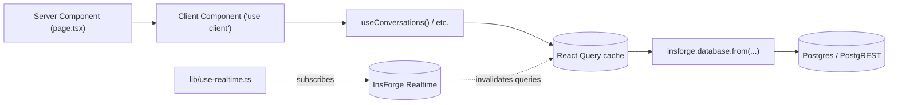

# Frontend

> Next.js 16 App Router, React 19, React Query 5, Tailwind 3.4, InsForge SDK 1.2.

## Stack

| Concern | Tool | Notes |
|---|---|---|
| Framework | Next.js 16 (App Router) | Server + Client Components |
| UI | React 19 | Server actions not currently used |
| Styling | Tailwind CSS 3.4 | **Do not upgrade to v4** (see `AGENTS.md`) |
| Data fetching | TanStack Query 5 | `lib/queries.ts` |
| Auth state | React Context | `lib/auth-context.tsx` |
| Realtime | InsForge Realtime (Socket.IO) | `lib/use-realtime.ts` |
| Server-side DB | `@insforge/sdk` with service role | `lib/insforge-admin.ts` |
| Client-side DB | `@insforge/sdk` with anon key | `lib/insforge.ts` |
| Markdown | `react-markdown` + `remark-gfm` | For KB document display |

## Project layout

```
app/                          # Pages (App Router)
  layout.tsx                  # Wraps with <AuthProvider> + <QueryProvider>
  page.tsx                    # Marketing landing
  login/                      # /login
  register/                   # /register (with workspace creation)
  inbox/                      # /inbox — main agent UI
  knowledge/                  # /knowledge — KB management
  analytics/                  # /analytics
  settings/                   # /settings (AI, SMS, email, web chat, team)
  customers/                  # /customers
  team/                       # /team — members list
  wchat/[widgetId]/           # Widget iframe content
  api/functions/              # 7 InsForge-verified, RBAC-checked routes
components/
  inbox/                      # Conversation list, thread, AI draft panel, etc.
  knowledge/                  # KB table, editor, document content
  customers/                  # Customer table, modals
  layout/                     # AppShell, Sidebar, AuthGuard, NavItem
  landing/                    # Marketing landing
  ui/                         # Button, Card, Input, Select, etc.
lib/
  insforge.ts                 # Browser client (anon key)
  insforge-admin.ts           # Server-side client (service role)
  auth-context.tsx            # <AuthProvider>, useAuth()
  query-provider.tsx          # <QueryProvider> wrapping <QueryClientProvider>
  queries.ts                  # useConversations, useMessages, useContacts, ...
  use-realtime.ts             # useRealtime() hook (Socket.IO)
  onboarding.ts               # createOrganizationWithOwner() (calls the SQL RPC)
proxy.ts                      # Auth redirect for protected routes
```

## Data flow



## Auth context

`lib/auth-context.tsx` provides `useAuth()` returning `{ user, loading, signIn, signUp, signOut }`.

- On mount, the provider calls `insforge.auth.getCurrentUser()` to hydrate.
- After `signIn` / `signUp`, the access token is written to the `insforge_access_token` cookie (max-age 7 days, SameSite=Lax). The cookie is read by `proxy.ts` for auth-gate redirects.
- `proxy.ts` matches all paths except `/_next/static`, `/_next/image`, `favicon.ico`, and the public paths (`/`, `/login`, `/register`). If the cookie is missing, the user is redirected to `/login`.

### Auth gating

- **Server-side**: `proxy.ts` redirects unauthenticated users on protected paths.
- **Client-side**: `useAuth()` returns `loading` until hydration; pages can early-return a spinner.
- **API routes**: `app/api/functions/_auth.ts` verifies the access token with InsForge before using the service-role client, then checks org membership permissions for the requested action.

## React Query conventions

`lib/queries.ts` defines the query keys and a `useAuthReady()` helper. Every hook checks `authReady && !!<id>` before firing.

### Query keys

```ts
export const queryKeys = {
  conversations: (orgId, filters) => ['conversations', orgId, filters],
  messages: (conversationId) => ['messages', conversationId],
  conversation: (id) => ['conversation', id],
  contacts: (filters) => ['contacts', filters],
  contact: (id) => ['contact', id],
  knowledgeDocs: () => ['knowledge-documents'],
  knowledgeDoc: (id) => ['knowledge-document', id],
  teamMembers: () => ['team-members'],
  aiDecision: (conversationId) => ['ai-decision', conversationId],
  orgMembership: (userId) => ['org-membership', userId],
};
```

### Available hooks

| Hook | Returns | Notes |
|---|---|---|
| `useOrgMembership(userId)` | `string \| null` (org id) | First org the user belongs to. |
| `useConversations(orgId, filters?)` | `Conversation[]` | Filters: `status`, `channel`, `contactId`, `search`. Excludes `status = 'resolved'` by default. Joins `contacts(*)`. |
| `useConversation(conversationId)` | `Conversation` (with contact) | Single conversation with joined contact. |
| `useMessages(conversationId)` | `Message[]` | Sorted ascending by `created_at`. |
| `useContacts(filters?)` | `Contact[]` | |
| `useContact(contactId)` | `Contact` | |
| `useAiDecision(conversationId)` | `AiDecision` (latest) | Used by the AI draft panel. |
| `useKnowledgeDocs()` | `KnowledgeDocument[]` | `staleTime: 0` so updates show up immediately. |
| `useKnowledgeDoc(docId)` | `KnowledgeDocument` | |
| `useTeamMembers()` | `OrganizationMember[]` | Currently does not join `users` — see [`../plans/ui-polish.md`](../plans/ui-polish.md). |

### Default React Query config

`lib/query-provider.tsx` sets `staleTime: 30_000`, `refetchOnWindowFocus: true`, `retry: 1`.

## Calling the backend

Frontend code uses three patterns to talk to the backend:

### 1. Direct DB reads (via `insforge.database.from()`)

For read-only queries that should be subject to RLS. Use the chainable SDK API:

```ts
const { data, error } = await insforge.database
  .from('conversations')
  .select('*, contacts(*)')
  .eq('organization_id', orgId)
  .order('last_message_at', { ascending: false });

if (error) throw new Error(error.message);
```

Always use `.from('table').select().eq().order()` — never raw `fetch()` to PostgREST.

### 2. Server-side writes (via Next.js API routes)

For writes, call the local Next.js route (`/api/functions/<name>`) using the access token:

```ts
const res = await fetch('/api/functions/send-reply', {
  method: 'POST',
  headers: {
    'Content-Type': 'application/json',
    Authorization: `Bearer ${getAccessToken()}`,
  },
  body: JSON.stringify({ conversationId, body }),
});
```

The access token comes from `getAccessToken()` in `lib/insforge.ts`, which reads it from the `insforge_access_token` cookie. (The token is in localStorage at runtime; the cookie is a parallel write to make it readable from the server.)

### 3. InsForge Realtime events

Use the `useRealtime()` hook in pages that should react to live updates:

```ts
useRealtime({
  messageChannel: `org:${orgId}`,
  conversationChannel: `org:${orgId}`,
  onNewMessage: (payload) => { /* e.g. refetch messages */ },
  onConversationUpdated: (payload) => { /* refetch conversation */ },
});
```

The hook subscribes via `insforge.realtime.connect()` / `.subscribe()` and unsubscribes on unmount. It tracks callbacks in a ref so changing handlers don't reset the subscription.

## InsForge SDK patterns

- **Auth**: `insforge.auth.signInWithPassword({ email, password })`, `insforge.auth.signUp({ email, password })`, `insforge.auth.getCurrentUser()`, `insforge.auth.signOut()`. All return `{ data, error }`.
- **Database**: `insforge.database.from('table').select()...`. Insert takes an array: `insert([{ ... }])`.
- **Realtime**: `insforge.realtime.connect()`, `subscribe(channel)`, `on(event, handler)`, `off(event, handler)`, `unsubscribe(channel)`.
- **Functions**: invoked via raw `fetch()` to `${INSFORGE_URL}/functions/v1/<name>` with `apikey` and `Authorization` headers — but the **frontend usually does not call Deno functions directly**; it goes through the local `/api/functions/*` routes.

## Adding a new page

1. Create `app/your-page/page.tsx`.
2. If the page needs auth, it can be a client component that uses `useAuth()` and early-returns while `loading` or while `!user`.
3. If the page needs data, prefer using an existing hook from `lib/queries.ts`; add a new one if needed.
4. Use Tailwind for styling. **Do not upgrade to v4.**
5. If the page should be public, add the path to `PUBLIC_PATHS` in `proxy.ts` and to the matcher exclusions in `proxy.ts` if it lives at the app root.

## Known gotchas

- **Two `StatusBadge` components** — `components/ui/StatusBadge.tsx` and `components/inbox/StatusBadge.tsx` exist and have different prop signatures. They conflict on import resolution. Tracked in [`../plans/ui-polish.md`](../plans/ui-polish.md).
- **Real-time channel names** — app code subscribes to `org:{orgId}` channels, which match the InsForge functions' published events. The hook also listens for legacy `message_created` events for compatibility.
- **`aria-invalid` typing** — the Input/Select/Textarea components historically passed a boolean to `aria-invalid`. ARIA spec requires the string `"true"`. Tracked in [`../plans/ui-polish.md`](../plans/ui-polish.md).
- **Team page name bug** — `useTeamMembers` selects from `organization_members` only (no `users` join), so the team page renders the user's UUID as the name. Tracked in [`../plans/ui-polish.md`](../plans/ui-polish.md).
