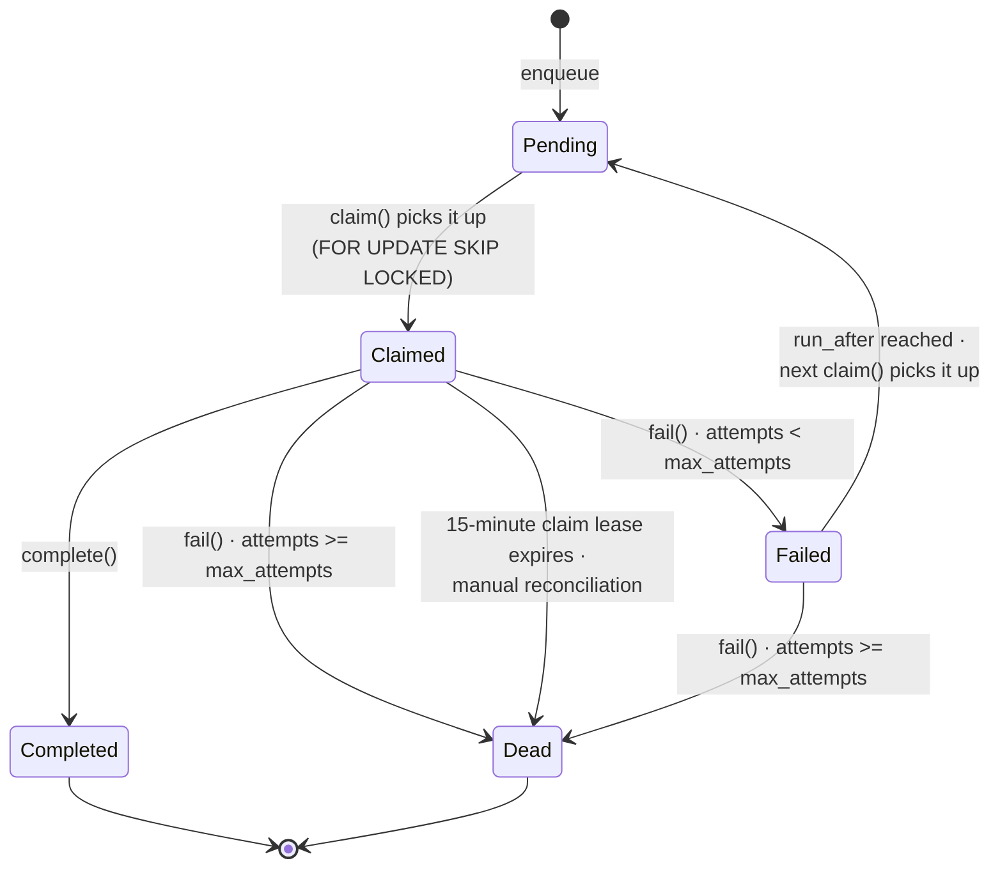

# Jobs

> Postgres-backed job queue. Lifecycle, types, payloads, and idempotency rules.

## Overview

The job queue is implemented in `packages/support-core/src/services/postgres-job-queue.ts` (implements the `JobQueue` interface). It is backed by the `support_jobs` table and the `claim_support_jobs` RPC.

### Backoff

`run_after = now() + 2^attempts seconds` (e.g. 2s, 4s, 8s, 16s, 32s).

### Dead-lettering

When `attempts >= max_attempts` (default 5), `fail()` sets `status = 'dead'`. Dead jobs are never re-claimed. They remain in the table for debugging.

### Claiming

`PostgresJobQueue.claim(limit)` calls the `claim_support_jobs` RPC, which uses `SELECT FOR UPDATE SKIP LOCKED` to atomically claim up to `limit` pending or retryable-failed jobs whose `run_after <= now()`. Before claiming new work, it quarantines claims older than 15 minutes as `dead` for manual reconciliation; it does not replay work whose external side effects are unknown.

### Idempotent enqueue

`enqueue()` checks for an existing job with the same `job_type` and canonical payload fields. Immutable source work (`process_ai_message`, `process_knowledge_document`, `send_outbound_message`, and `record_chunk_refs`) stays idempotent across completed/dead states so a late webhook cannot replay it; delivery-status events dedupe only while active. The queue also persists a deterministic key so concurrent active enqueues are protected by a database uniqueness constraint.

| `job_type` | Idempotency key fields |
|---|---|
| `process_ai_message` | `conversationId`, `messageId` |
| `process_knowledge_document` | `documentId`, `revision` |
| `send_outbound_message` | `conversationId`, `aiDecisionId` |
| `process_delivery_status` | `externalMessageId` |
| `record_chunk_refs` | `ai_decision_id` |
| `retry_failed_jobs` | (no idempotency key) |

Source: `IDEMPOTENCY_KEYS` in `postgres-job-queue.ts`.

## Job types

| `job_type` | Enqueued by | Handler | Payload |
|---|---|---|---|
| `process_ai_message` | `InboundMessageService.processInbound` (SMS, email, webchat) and `app/api/functions/regenerate-ai-draft/route.ts` | `process-jobs` → `AiAgentService.processMessage(conversationId, orgId, { sourceJobId })` | Inbound: `{ conversationId, messageId }`; regenerate: `{ conversationId }` |
| `process_knowledge_document` | Frontend when a knowledge doc is uploaded, edited, or reprocessed | `process-jobs` → `KnowledgeIngestionService.processDocument(documentId, revision)` | `{ documentId, revision }` |
| `send_outbound_message` | `process-jobs` when an inline AI auto-reply send fails | `process-jobs` → `OutboundMessageService.sendReply(...)` | `{ conversationId, body, senderType, aiDecisionId }` |
| `process_delivery_status` | (not currently enqueued) | **Stub** — delivery status is processed synchronously in the webhook handlers | `{ externalMessageId, ... }` |
| `retry_failed_jobs` | (not currently enqueued) | **Stub** — intended for periodic retry of failed jobs | (no payload) |

See `JobType` in `packages/support-core/src/types/index.ts`.

## Handler implementation

Handlers live in `insforge/functions/process-jobs/index.ts` (`buildJobHandlers`). The function claims up to 10 jobs per invocation and dispatches each to the registered handler by `job_type`.

| Status | Outcome |
|---|---|
| Handler returns normally | `jobQueue.complete(jobId)` — sets `status='completed'`, `completed_at=now()`. |
| Handler throws | `jobQueue.fail(jobId, err.message)` — increments `attempts`, applies backoff or dead-letters. |
| Handler succeeds but completion write fails | Retries `complete()` three times, then conditionally quarantines the still-claimed row as dead and reports `completion_quarantined` without replaying the handler. |
| Non-retryable handler outcome | Quarantines the row as dead and reports `quarantined` so accepted or outcome-unknown provider requests are not replayed. |
| Handler fails but failure write also fails | Retries the failure write three times, then reports `failure_persistence_failed`; a later claim cycle quarantines the expired claim. |
| Unknown `job_type` | `jobQueue.fail(jobId, "Unknown job type: <type>")`. |

The process-jobs function is invoked by:
- The InsForge cron/scheduler.
- The scheduled `process-jobs` worker after `sms-inbound`, `email-inbound`, or `webchat-inbound` enqueue an AI job.
- The `regenerate-ai-draft` Next.js route after enqueuing; failures are logged
  and the durable job remains for the scheduler.

Every caller uses `POST` with `X-Process-Jobs-Secret` set from the server-only
`PROCESS_JOBS_SECRET`; the scheduler should reference the matching InsForge
secret rather than embedding its value.

## Enqueue sites

| File | Site |
|---|---|
| `packages/support-core/src/services/inbound-message-service.ts:137` | webchat inbound — enqueue `process_ai_message` |
| `packages/support-core/src/services/inbound-message-service.ts:217` | SMS/email inbound — enqueue `process_ai_message` |
| `insforge/functions/process-jobs/index.ts` | inline `auto_reply` delivery failure — enqueue `send_outbound_message` |
| `app/api/functions/regenerate-ai-draft/route.ts:23` | manual regenerate — enqueue `process_ai_message` |

## Known quirks

- **Claim RPC compatibility** — `PostgresJobQueue.claim()` first calls the historical `{ max_count: limit }` signature and retries with `{ claim_limit: limit }` when the backend reports the old name is unavailable. This supports databases at either migration level while preserving the requested limit.
- **Unsupported retry handlers fail explicitly** — `process_delivery_status` and `retry_failed_jobs` are reserved for future async retry paths and currently throw clear "not implemented" errors so claimed jobs do not complete as no-ops. `send_outbound_message` is implemented for AI auto-reply fallback/retry.
- **Reconciliation outcomes are observable** — quarantined, completion-quarantined, and persistence-failure results make the worker respond with `status='reconciliation_required'` and HTTP 500. If an outage prevents every status write, the 15-minute claim lease later moves the row to `dead` without replaying it.
- **`countConsecutiveFailures` heuristic** — In `ai-agent-service.ts`, the `RepeatedFailureRule` receives a `consecutiveAiFailures` count derived only from the conversation's current `ai_state === 'failed'` (returns 1 if true, 0 otherwise). It does not query `ai_decisions` for a true consecutive-failure count. The rule is therefore under-sensitive in practice. See `MULTI_ROUND_AI_FIX_PLAN.md` in the repo root (or `docs/plans/multi-round-ai-fix.md` once moved).

## Adding a new job type

1. Add the new `job_type` to the `JobType` union in `packages/support-core/src/types/index.ts`.
2. Define the payload shape (use snake_case for the DB row, mapped in handlers).
3. Add a handler in `buildJobHandlers` in `insforge/functions/process-jobs/index.ts`.
4. If the job should be idempotent, add idempotency keys in `IDEMPOTENCY_KEYS` in `postgres-job-queue.ts`.
5. Enqueue from the service or route that should trigger it.
6. Add a property-based test in `__tests__/properties/job-queue.prop.test.ts` for idempotency / backoff / dead-lettering as relevant.
7. Update the table in this document.
