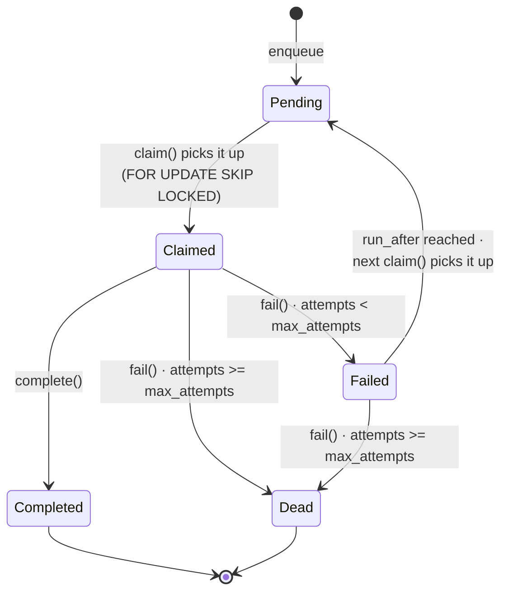

# Jobs

> Postgres-backed job queue. Lifecycle, types, payloads, and idempotency rules.

## Overview

The job queue is implemented in `packages/support-core/src/services/postgres-job-queue.ts` (implements the `JobQueue` interface). It is backed by the `support_jobs` table and the `claim_support_jobs` RPC.

### Backoff

`run_after = now() + 2^attempts seconds` (e.g. 2s, 4s, 8s, 16s, 32s).

### Dead-lettering

When `attempts >= max_attempts` (default 5), `fail()` sets `status = 'dead'`. Dead jobs are never re-claimed. They remain in the table for debugging.

### Claiming

`PostgresJobQueue.claim(limit)` calls the `claim_support_jobs` RPC, which uses `SELECT FOR UPDATE SKIP LOCKED` to atomically claim up to `limit` pending jobs whose `run_after <= now()`. This prevents two workers from processing the same job.

### Idempotent enqueue

`enqueue()` checks for an existing `pending` or `claimed` job with the same `job_type` and matching key payload fields (PostgREST `contains` operator on `payload`). If found, returns the existing job instead of creating a duplicate.

| `job_type` | Idempotency key fields |
|---|---|
| `process_ai_message` | `conversationId`, `messageId` |
| `process_knowledge_document` | `documentId` |
| `send_outbound_message` | `conversationId`, `messageId` |
| `process_delivery_status` | `externalMessageId` |
| `retry_failed_jobs` | (no keys — at most one pending) |

Source: `IDEMPOTENCY_KEYS` in `postgres-job-queue.ts`.

## Job types

| `job_type` | Enqueued by | Handler | Payload |
|---|---|---|---|
| `process_ai_message` | `InboundMessageService.processInbound` (SMS, email, webchat) and `app/api/functions/regenerate-ai-draft/route.ts` | `process-jobs` → `AiAgentService.processMessage(conversationId, orgId)` | `{ conversationId, messageId }` |
| `process_knowledge_document` | Frontend when a knowledge doc is uploaded (and possibly internal flows) | `process-jobs` → `KnowledgeIngestionService.processDocument(documentId)` | `{ documentId }` |
| `send_outbound_message` | `AiAgentService` when AI auto-replies in `auto_reply` mode | **Stub** — not yet implemented; outbound sends currently happen synchronously via `OutboundMessageService.sendReply` and the Next.js `send-reply` route | `{ conversation_id, body, sender_type, ai_decision_id }` |
| `process_delivery_status` | (not currently enqueued) | **Stub** — delivery status is processed synchronously in the webhook handlers | `{ externalMessageId, ... }` |
| `retry_failed_jobs` | (not currently enqueued) | **Stub** — intended for periodic retry of failed jobs | (no payload) |

See `JobType` in `packages/support-core/src/types/index.ts`.

## Handler implementation

Handlers live in `insforge/functions/process-jobs/index.ts` (`buildJobHandlers`). The function claims up to 10 jobs per invocation and dispatches each to the registered handler by `job_type`.

| Status | Outcome |
|---|---|
| Handler returns normally | `jobQueue.complete(jobId)` — sets `status='completed'`, `completed_at=now()`. |
| Handler throws | `jobQueue.fail(jobId, err.message)` — increments `attempts`, applies backoff or dead-letters. |
| Unknown `job_type` | `jobQueue.fail(jobId, "Unknown job type: <type>")`. |

The process-jobs function is invoked by:
- The InsForge cron/scheduler.
- A fire-and-forget POST from `sms-inbound`, `email-inbound`, and `webchat-inbound` after enqueuing the AI job.
- The `regenerate-ai-draft` Next.js route after enqueuing.

## Enqueue sites

| File | Site |
|---|---|
| `packages/support-core/src/services/inbound-message-service.ts:137` | webchat inbound — enqueue `process_ai_message` |
| `packages/support-core/src/services/inbound-message-service.ts:217` | SMS/email inbound — enqueue `process_ai_message` |
| `packages/support-core/src/services/ai-agent-service.ts:373` | `auto_reply` mode — enqueue `send_outbound_message` |
| `app/api/functions/regenerate-ai-draft/route.ts:23` | manual regenerate — enqueue `process_ai_message` |

## Known quirks

- **Parameter name mismatch** — The `claim_support_jobs` RPC declares its parameter as `claim_limit`, but `PostgresJobQueue.claim()` calls it as `{ max_count: limit }`. This is a bug: the call passes `max_count` as the `claim_limit` arg, but because both have defaults the call works (defaulting `claim_limit` to 5). The fix is to rename to align (call site should pass `{ claim_limit: limit }` and the RPC should use that name). Tracked in [`../plans/refactor.md`](../plans/refactor.md).
- **Stubs are no-ops** — `send_outbound_message`, `process_delivery_status`, and `retry_failed_jobs` handlers are empty (just a `// TODO` comment). Jobs of these types are claimed and immediately fail (or never get enqueued in the first place for delivery status). This means async retries of failed outbound sends are not implemented; outbound sends are currently synchronous.
- **`countConsecutiveFailures` heuristic** — In `ai-agent-service.ts`, the `RepeatedFailureRule` receives a `consecutiveAiFailures` count derived only from the conversation's current `ai_state === 'failed'` (returns 1 if true, 0 otherwise). It does not query `ai_decisions` for a true consecutive-failure count. The rule is therefore under-sensitive in practice. See `MULTI_ROUND_AI_FIX_PLAN.md` in the repo root (or `docs/plans/multi-round-ai-fix.md` once moved).

## Adding a new job type

1. Add the new `job_type` to the `JobType` union in `packages/support-core/src/types/index.ts`.
2. Define the payload shape (use snake_case for the DB row, mapped in handlers).
3. Add a handler in `buildJobHandlers` in `insforge/functions/process-jobs/index.ts`.
4. If the job should be idempotent, add idempotency keys in `IDEMPOTENCY_KEYS` in `postgres-job-queue.ts`.
5. Enqueue from the service or route that should trigger it.
6. Add a property-based test in `__tests__/properties/job-queue.prop.test.ts` for idempotency / backoff / dead-lettering as relevant.
7. Update the table in this document.
