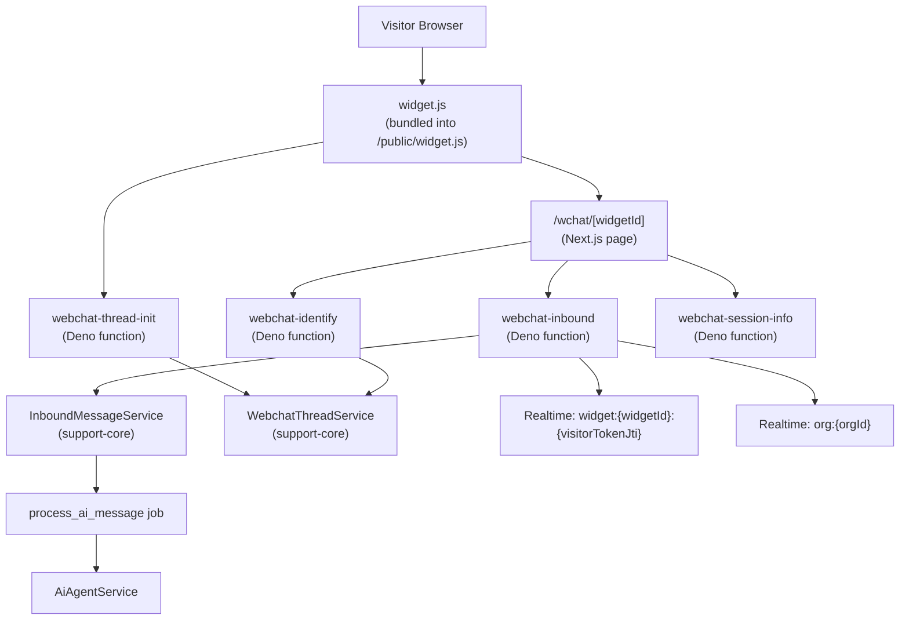
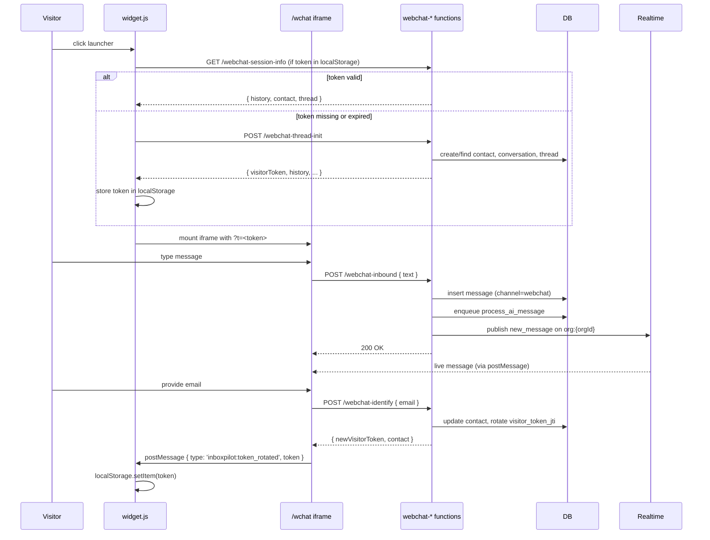

# Web Chat Widget

> Embeddable JS snippet for live chat between an anonymous (→ identified) visitor and an InboxPilot agent. Reuses the existing AI pipeline, RAG, escalation, job queue, and audit logs without forking them.

## Embed snippet

```html
<script src="https://your-app.example.com/widget.js"
        data-widget-id="wt_abc123"
        data-position="bottom-right"
        data-color="#2563eb"></script>
```

| Attribute | Required | Description |
|---|---|---|
| `data-widget-id` | yes | The widget's public `widget_token`. Found in Settings → Web Chat. |
| `data-position` | no | `bottom-right` (default) or `bottom-left`. |
| `data-color` | no | Primary color for the launcher button. Defaults to `#2563eb`. |

The widget script:
1. Reads `data-widget-id` from its own script tag.
2. Resumes a prior session from `localStorage` if a valid (non-expired) visitor token exists.
3. Otherwise calls `POST /functions/v1/webchat-thread-init` to mint a fresh visitor token.
4. Mounts an iframe pointing to `https://<app>/wchat/<widgetId>?t=<token>`.
5. Parent ↔ iframe communicate via `postMessage`.

## Architecture



The widget reuses the **same** `conversations` and `messages` tables as SMS/email (just with `channel = 'webchat'`), and the **same** `process_ai_message` job / `AiAgentService` for AI handling. There is no webchat-specific AI path.

## Visitor session lifecycle



## Visitor JWT

Webchat uses a **separate** JWT from InsForge user auth:

- **Algorithm**: HS256
- **Signing key**: the widget's `hmac_secret` (per-widget, server-side)
- **Issuer**: `webchat-thread-init` (signs) and `webchat-identify` (re-signs after JTI rotation)
- **Verifier**: `insforge/functions/_shared/verify-visitor-jwt.ts` (in `webchat-inbound`, `webchat-identify`, `webchat-session-info`)

**Claims**:

| Claim | Description |
|---|---|
| `sub` | contactId |
| `org` | organizationId |
| `widget` | widgetId |
| `thread` | threadId |
| `jti` | visitor token JTI (must match `webchat_threads.visitor_token_jti`) |
| `iat` | issued at |
| `exp` | expiry (default 24h) |

**JTI rotation**: When a visitor is identified via `webchat-identify`, the server generates a new `visitor_token_jti` in `webchat_threads` and signs a new JWT with it. The old JWT is invalidated because the verification step checks that the JWT's `jti` matches the current `webchat_threads.visitor_token_jti`.

The widget iframe communicates the rotated token back to the parent via `postMessage`:
```js
{ type: 'inboxpilot:token_rotated', token: '<new>' }
```
…and the parent updates `localStorage`.

## Anti-flood and CORS

- **CORS** — `webchat-thread-init`, `webchat-inbound`, `webchat-identify`, and `webchat-session-info` all return CORS headers and handle `OPTIONS` preflight (helpers in `insforge/functions/_shared/cors.ts`).
- **Origin allowlist** — each widget has an `allowed_domains` array. `webchat-thread-init` checks the request `Origin` header against this list. Empty array = allow all (dev mode). Wildcards: `*.example.com` matches `example.com` and any subdomain.
- **Anti-flood** — `webchat-inbound` enforces 10 messages/minute/thread via an in-memory rate limiter. Per-worker (so it doesn't coordinate across multiple workers, but it's good enough to stop a single bad actor).

## Configuration

Widget configuration is in the `webchat_widgets` table. Editable via Settings → Web Chat (or directly via the DB if you haven't built the UI yet).

| Column | Purpose |
|---|---|
| `name` | Internal name |
| `widget_token` | The public token. Sent in the snippet's `data-widget-id`. |
| `hmac_secret` | Per-widget signing key. Server-side only. |
| `allowed_domains` | Origin allowlist (empty = allow all) |
| `position` | `bottom-right` \| `bottom-left` |
| `primary_color` | Launcher color |
| `greeting` | Optional first system message on thread init |
| `pre_chat_enabled` | If true, widget shows a name/email form before opening |
| `ai_mode_override` | Optional per-widget override of org-level AI mode (`off` / `draft_only` / `auto_reply`) |
| `is_active` | Disables the widget without deleting it |

## Building the widget

The widget bundle lives in `widget-src/`. It's a standalone Vite build that produces `public/widget.js`.

```bash
# From repo root
npm run build:widget
# Equivalent to: cd widget-src && npm run build
```

The build:
- Entry: `widget-src/widget.ts`
- Output: `public/widget.js` (IIFE, minified via terser, dynamic imports inlined)
- Build config: `widget-src/vite.config.mts`

`public/widget.js` is served by the Next.js app (it's a static file) at `/widget.js`.

## Local development

1. Start the Next.js dev server: `npm run dev`.
2. Either:
   - Set `NEXT_PUBLIC_DEMO_WIDGET_ID` to an existing widget's token, and the marketing landing page (`/`) will mount a chat button.
   - Or add the embed snippet to a test page directly.
3. The widget will call `${NEXT_PUBLIC_INSFORGE_URL}/functions/v1/webchat-*` for backend calls. Make sure your env points to a deployed InsForge backend with the webchat functions deployed.

## Realtime delivery to the visitor

The widget iframe subscribes to its own visitor-specific channel via the parent page's `postMessage` relay. The actual publishing happens in:

- `webchat-inbound` — when a visitor sends a message, after the message is inserted, publishes `new_message` on `org:{orgId}` (for the agent inbox).
- `app/api/functions/send-reply/route.ts` and `app/api/functions/approve-ai-draft/route.ts` — when an agent sends a message on a webchat conversation, publishes `new_message` on `widget:{widgetId}:{visitorTokenJti}` (for the visitor's iframe).

The parent page of the iframe listens for these events and forwards them to the iframe via `postMessage`.

## See also

- [`../adr/7.3-webchat-widget.md`](../adr/7.3-webchat-widget.md) — the design ADR with locked decisions.
- [`webchat.md`](api.md#insforge-deno-functions-9) — function reference for the four webchat endpoints.
- [`database.md`](database.md#webchat-added-in-migration-005) — schema for `webchat_widgets` and `webchat_threads`.
